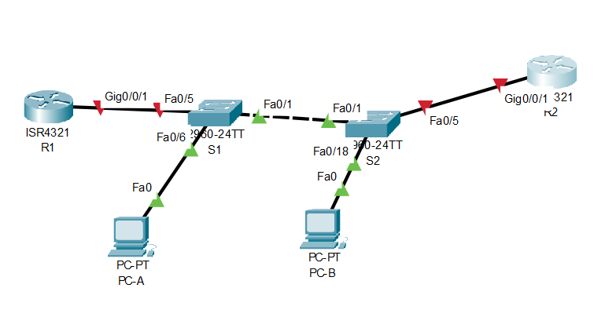

# Лабораторная работа. Базовая настройка коммутатора
## Задачи
1. **Проверка конфигурации коммутатора по умолчанию**
2. **Создание сети и настройка основных параметров устройства**
    - Настройте базовые параметры коммутатора
    - Настройте IP-адрес для ПК
3. **Проверка сетевых подключений**
    - Отобразите конфигурацию устройства
    - Протестируйте сквозное соединение, отправив эхо-запрос
    - Протестируйте возможности удаленного управления с помощью Telnet

## Решение
1.1.Для проверки настроек коммутатора по умолчанию необходимо соединить PC и коммутатор с помощью консольного кабеля. (картинка1)

С помощью программы эмуляции терминала устанавливаем консольное подключение к коммутатору с РС
(картинка 2)

1.2.Проверяем настройки коммутатора по умолчанию. 
a) С помощью команды show running-config смотрим файл [конфигурации](default_config)
b) На коммутаторе 2960 имеется 24 интерфейса FastEhternet;
   На коммутаторе 2960 имеется 2 интрфейса GigabitEhternet;
   Диапазон значений, отображаемых в VTY-линиях 0-15;
c)
```
Switch#show startup-config 
startup-config is not present
 ```
Данное сообщение появляется по причине того, что мы первый раз включаем коммутатор и в ОЗУ не содержится файл загрузочной конфигурации. Мы его сохраним после настройки.

d)IP-адрес сети VLAN1 не назначен, интерфейс отключен.
MAC????
картинка 3
e) картинка 4
f)Подключим Ethernet-кабель PC к порту 6 на коммутаторе
картинка 5
После подключения вводим команду show ip interface vlan1 - выходные данные не изменились
g)коммутатор работает под управлением 15 версии
картинка 6

Файл образа системы System image file is "flash:c2960-lanbasek9-mz.150-2.SE4.bin"
Base ethernet MAC Address       : 00:17:59:A7:51:80
h) изучим свойства [интерфейса](f06), к которому подключен PC
Делаем вывод, что
   
2. После создания сети в Cisko Packet Tracer получаем: 

Настраеваем базовые параметры коммутатора
 ```
no ip domain-lookup
hostname S1
service password-encryption
enable secret class
banner motd #Unauthorized access is strictly prohibited.
  #
 ```
Настраиваем IP-адресс для ПК


3. В результате работы получаем итоговую [конфигурацию](config)
   Для проверки сквозного соединения отправляем эхо-запросы насетевую карту PC и на административный адресс интерфейса SVI коммутатора S1

    Возможность доступа к удаленному управлению коммутатором с помощью Telnet так же проверена
    
