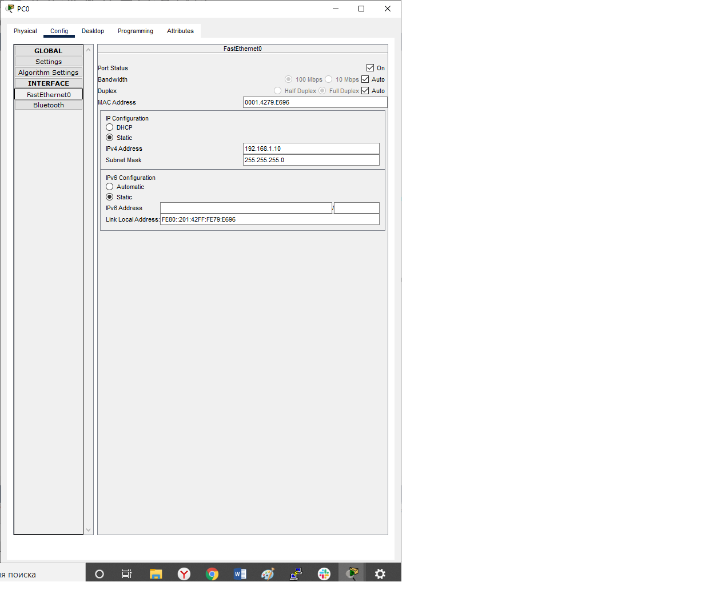
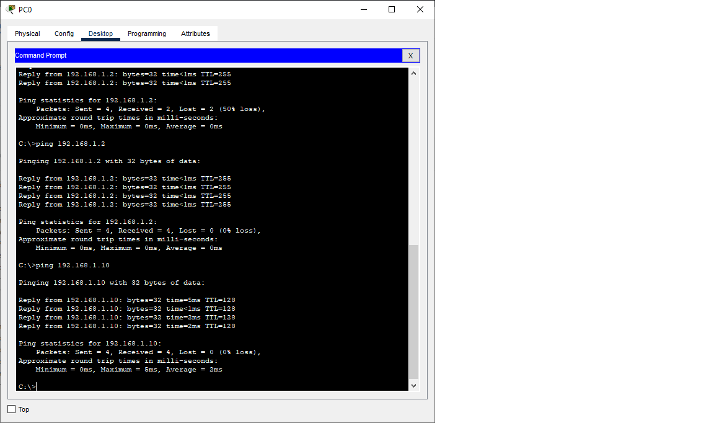
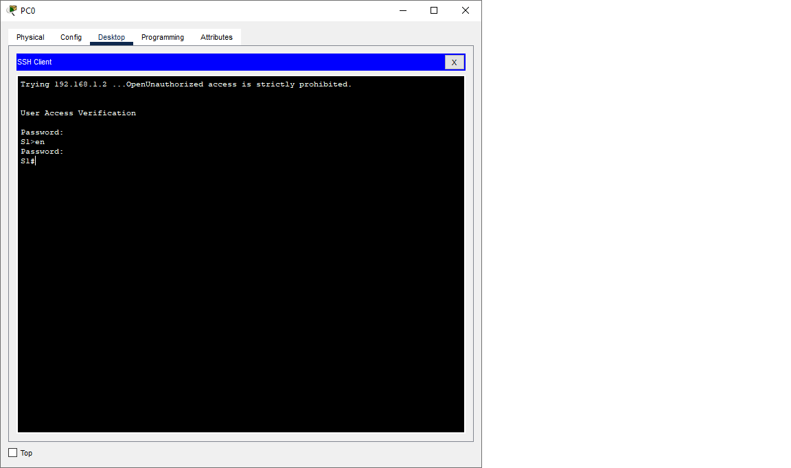

# Лабораторная работа. Базовая настройка коммутатора
## Задачи
1. **Проверка конфигурации коммутатора по умолчанию**
2. **Создание сети и настройка основных параметров устройства**
    - Настройте базовые параметры коммутатора
    - Настройте IP-адрес для ПК
3. **Проверка сетевых подключений**
    - Отобразите конфигурацию устройства
    - Протестируйте сквозное соединение, отправив эхо-запрос
    - Протестируйте возможности удаленного управления с помощью Telnet

## Решение
1.1.Для проверки настроек коммутатора по умолчанию необходимо соединить PC и коммутатор с помощью консольного кабеля. (картинка1)

С помощью программы эмуляции терминала устанавливаем консольное подключение к коммутатору с РС
(картинка 2)

1.2.Проверяем настройки коммутатора по умолчанию. 
a) С помощью команды show running-config смотрим файл [конфигурации](default_config)
b) На коммутаторе 2960 имеется 24 интерфейса FastEhternet;
   На коммутаторе 2960 имеется 2 интрфейса GigabitEhternet;
   Диапазон значений, отображаемых в VTY-линиях 0-15;
c)
```
Switch#show startup-config 
startup-config is not present
 ```
Данное сообщение появляется по причине того, что мы первый раз включаем коммутатор и в ОЗУ не содержится файл загрузочной конфигурации. Мы его сохраним после настройки.

d)IP-адрес сети VLAN1 не назначен, интерфейс отключен.
MAC????
картинка 3
e) картинка 4
f)Подключим Ethernet-кабель PC к порту 6 на коммутаторе
картинка 5
После подключения вводим команду show ip interface vlan1 - выходные данные не изменились
g)коммутатор работает под управлением 15 версии
картинка 6

Файл образа системы System image file is "flash:c2960-lanbasek9-mz.150-2.SE4.bin"
Base ethernet MAC Address       : 00:17:59:A7:51:80
h) изучим свойства [интерфейса](f06), к которому подключен PC
Делаем вывод, что включен????? 
MAC адресс интерфейса 0060.4726.2306
Значение скорости и дуплекса Full-duplex, 100Mb/s
i)Изучим параметры сети VLAN
картинка 7
По умолчанию сети VLAN 1 присвоено имя default
Сеть активна
Относится к типу ENET????
j)
   
2.1 Настраеваем базовые параметры коммутатора
a)В режиме глобальной конфигурации выполним следующие команды
 ```
no ip domain-lookup   
hostname S1
service password-encryption
enable secret class
banner motd #Unauthorized access is strictly prohibited.
  #
 ```
Тут мы запретили поиск в DNS, задали имя коммутатора, включиди шифрование пароля, задали пароль для привелигированного режима, задали сообщение дня.
b)Назначим IP-адресс интерфейсу SVI
Так как в методических указаниях даны рекомендации для административной VLAN, создадим VLAN 30 и сделаем ее административной.
```
S1(config)#interface vlan 30
S1(config-if)#
%LINK-5-CHANGED: Interface Vlan30, changed state to up

S1(config-if)#ip address 192.168.1.2 255.255.255.0
S1(config-if)#no sh
S1(config-if)#no shutdown 
S1(config-if)#exit
S1(config)#in
S1(config)#interface ra
S1(config)#interface range f0/1 - 24
S1(config-if-range)#swi
S1(config-if-range)#switchport ac
S1(config-if-range)#switchport access vlan 30
S1(config-if-range)#
%LINEPROTO-5-UPDOWN: Line protocol on Interface Vlan30, changed state to up

S1(config-if-range)#exit
S1(config)#in
S1(config)#interface ra
S1(config)#interface range g0/1 - 2
S1(config-if-range)#swi
S1(config-if-range)#switchport ac
S1(config-if-range)#switchport access vlan 30
S1(config-if-range)#exit
S1(config)#exit
S1#
```
с) Ограничим доступ через порт консоли.
```
S1# 
S1#conf t
Enter configuration commands, one per line.  End with CNTL/Z.
S1(config)#line con 0
S1(config-line)#pasw
S1(config-line)#pass
S1(config-line)#password cisco
S1(config-line)#login
S1(config-line)#
S1(config-line)#logg
S1(config-line)#logging s
S1(config-line)#logging synchronous 
S1(config-line)#exit
S1(config)#
```

d)Настроим каналы виртуального соединения для удаленного управления (vty)
```
S1(config)#
S1(config)#line vty 0 15
S1(config-line)#pass
S1(config-line)#password cisco
S1(config-line)#login
S1(config-line)#end
S1#
%SYS-5-CONFIG_I: Configured from console by console

S1#
```
Команда логин нужна для подтверждения пароля.


2. Настраиваем IP-адресс для ПК


3.1 В результате работы получаем итоговую [конфигурацию](config)
   Проверим параметры VLAN 1 и VLAN30
   
   VLAN1 выключен, VLAN30 включен
   
3.2 Для проверки сквозного соединения отправляем эхо-запросы насетевую карту PC и на административный адресс интерфейса SVI коммутатора S1

3.3 Возможность доступа к удаленному управлению коммутатором с помощью Telnet так же проверена
    
    Сохраним конфигурацию
```
S1#copy 
S1#copy r
S1#copy running-config st
S1#copy running-config startup-config 
Destination filename [startup-config]? 
Building configuration...
[OK]
S1#
```
