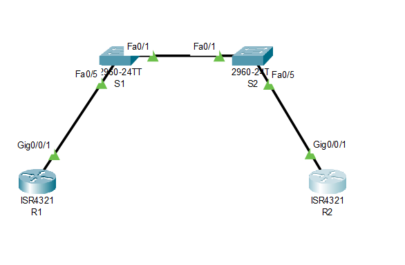

# Лабораторная работа. Настройка протокола OSPFv2 для одной области
## Задачи
Часть 1. Создание сети и настройка основных параметров устройства
Часть 2. Настройка и проверка базовой работы протокола  OSPFv2 для одной области
Часть 3. Оптимизация и проверка конфигурации OSPFv2 для одной области


  **Таблица адресации**   
  
| Устройство |Интерфейс    | IP-адрес     | Маска подсети  |
|------------|-------------|--------------|----------------|
|    R1      | G 0/0/1     | 10.53.0.1    |255.255.255.0   |
|            | Loopback1   | 172.16.1.1   |255.255.255.0   |
|    R2      | G 0/0/1     | 10.53.0.2    |255.255.255.0   |
|            | Loopback1   | 192.168.1.1  |255.255.255.0   |

## Ход выполнения работы    
### 1. Настройка основных параметров устройств  
Создадим топологию, согласно заданию    
Произведем базовую настройку маршрутизаторов и коммутаторов. Данные настройки можно увидеть в конфигурациях ниже. 

### 2. Настройка и проверка базовой работы протокола OSPFv2 для одной области 
***Настроим адреса интерфейса и базового OSPFv2 на каждом маршрутизаторе.*** 
Настроим адреса интерфейсов, согласно таблице адресации (на примере R1)
``` 
R1(config)#int g0/0/1 
R1(config-if)#ip address 10.53.0.1 255.255.255.0 
R1(config-if)#int loopback1 
R1(config-if)ip address 172.16.1.1 255.255.255.0 
``` 
Перейдем в режим конфигурации маршрутизатора OSPF, используя идентификатор процесса 56. 
Настроим статический идентификатор маршрутизатора для каждого маршрутизатора 
``` 
R1(config)#router ospf 56
R1(config-router)#router-id 1.1.1.1 
``` 
Настроим OSPF для сети между R1 и R2, поместив ее в область 0.  
```  
R1(config)#router ospf 56
R1(config-router)#network 10.53.0.0 0.0.0.255 area 0 
``` 
На R2 добавим конфигурацию, необходимую для объявления сети Loopback 1 в область OSPF 0. 
``` 
R2(config)#router ospf 56
R2(config-router)#network 192.168.1.0 0.0.0.255 area 0  
``` 
Убедимся, что ежду R1 и R2 сформировалась смежность 
``` 
R1#show ip ospf neighbor 

Neighbor ID     Pri   State           Dead Time   Address         Interface
2.2.2.2           1   FULL/BDR        00:01:46    10.53.0.2       GigabitEthernet0/0/1
R1# 
``` 

``` 
R2#show ip ospf neighbor 


Neighbor ID     Pri   State           Dead Time   Address         Interface
1.1.1.1          1   FULL/DR         00:01:40    10.53.0.1       GigabitEthernet0/0/1
R2#
``` 
Видим, что DR является R1 
 
Запустим пинг до Loopback R2 от R1 
``` 
1#ping 172.16.1.1

Type escape sequence to abort.
Sending 5, 100-byte ICMP Echos to 172.16.1.1, timeout is 2 seconds:
!!!!!
Success rate is 100 percent (5/5), round-trip min/avg/max = 2/5/15 ms

R1#
``` 
Все прошло успешно. 

### 3. Оптимизация и проверка конфигурации OSPFv2 для одной области 
*После выполнения заданий из методички, убедимся, что отптимизация OSPF удалась 
Выполним команду show ip ospf interface g0/0/1 на R1 и убедимся, что приоритет интерфейса установлен равным 50, а временные интервалы — Hello 30, Dead 120, а тип сети по умолчанию — Broadcast *
``` 
R1#show ip ospf interface g0/0/1

GigabitEthernet0/0/1 is up, line protocol is up
  Internet address is 10.53.0.1/24, Area 0
  Process ID 56, Router ID 1.1.1.1, Network Type BROADCAST, Cost: 1
  Transmit Delay is 1 sec, State DR, Priority 50
  Designated Router (ID) 1.1.1.1, Interface address 10.53.0.1
  Backup Designated Router (ID) 2.2.2.2, Interface address 10.53.0.2
  Timer intervals configured, Hello 30, Dead 120, Wait 120, Retransmit 5
    Hello due in 00:00:22
  Index 1/1, flood queue length 0
  Next 0x0(0)/0x0(0)
  Last flood scan length is 1, maximum is 1
  Last flood scan time is 0 msec, maximum is 0 msec
  Neighbor Count is 1, Adjacent neighbor count is 1
    Adjacent with neighbor 2.2.2.2  (Backup Designated Router)
  Suppress hello for 0 neighbor(s) 
  ``` 
*На R1 выполните команду show ip route ospf, чтобы убедиться, что сеть R2 Loopback1 присутствует в таблице маршрутизации.*
``` 
R1#show ip route ospf 
O    192.168.1.0 [110/2] via 10.53.0.2, 00:05:45, GigabitEthernet0/0/1
``` 
*Введем команду show ip route ospf на маршрутизаторе R2. Единственная информация о маршруте OSPF должна быть распространяемый по умолчанию маршрут R1.*
``` 
R2#show ip route ospf 
O*E2 0.0.0.0/0 [110/1] via 10.53.0.1, 00:13:35, GigabitEthernet0/0/1
``` 
*Запустите Ping до адреса интерфейса R1 Loopback 1 из R2. Выполнение команды ping должно быть успешным.* 
``` 
R2#ping 172.16.1.1

Type escape sequence to abort.
Sending 5, 100-byte ICMP Echos to 172.16.1.1, timeout is 2 seconds:
!!!!!
Success rate is 100 percent (5/5), round-trip min/avg/max = 0/0/1 ms

R2# 
``` 
Итоговые конфиги [R1](config/R1),[R2](config/R2)


