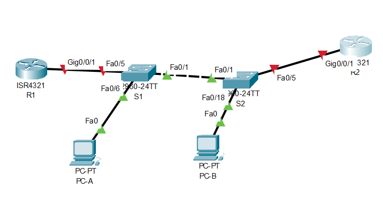
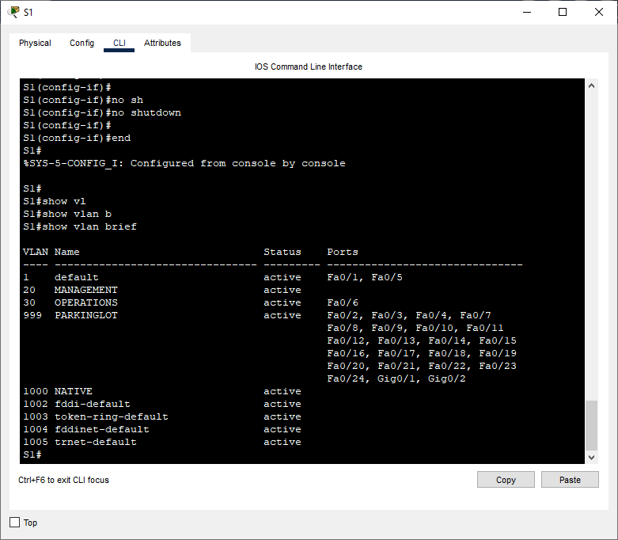
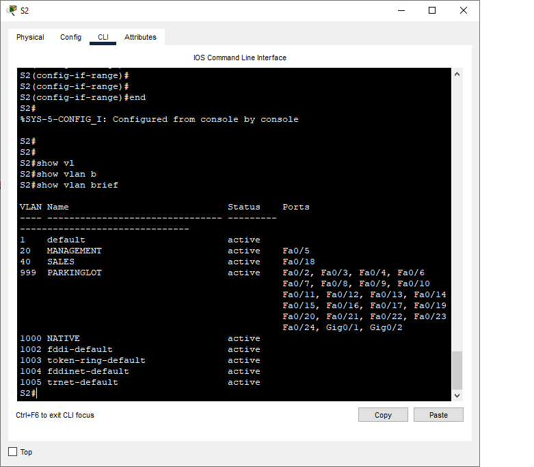
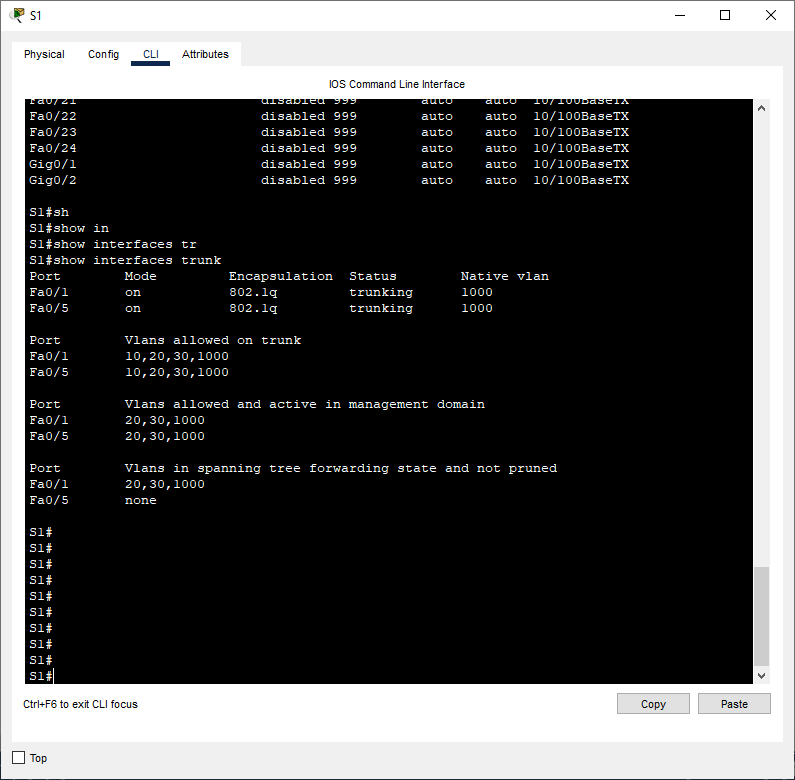
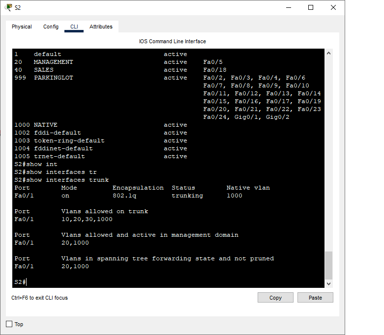

# Лабораторная работа. Настройка и проверка расширенных списков контроля доступа
## Задачи
**Часть 1. Создание сети и настройка основных параметров устройства** 

**Часть 2. Настройка и проверка списков расширенного контроля доступа**
 ***Таблица адресации*** 
  
  
| Устройство |Интерфейс     | IP-адрес      | Маска подсети  | Шлюз по умолчанию|
|------------|--------------|---------------|----------------|------------------|
|    R1      | G 0/0/1      |-              |-               |        -         |
|            | G 0/0/1.20   | 10.20.0.1     |255.255.255.0   |        -         |
|            | G 0/0/1.30   | 10.30.0.1     |255.255.255.0   |        -         |
|            | G 0/0/1.40   | 10.40.0.1     |255.255.255.0   |        -         |
|            | G 0/0/1.1000 | -             |  -             |        -         |
|            | Loopback1    | 172.16.1.1    |255.255.255.0   |        -         |
|    R2      | G 0/0/1      | 10.20.0.4     |255.255.255.0   |        -         |
|    S1      | VLAN 20      | 10.20.0.2     |255.255.255.0   |    10.20.0.1     |
|    S2      | VLAN 20      | 10.20.0.3     |255.255.255.0   |    10.20.0.1     |
|    PC0     | NIC          | 10.30.0.10    |255.255.255.0   |    10.30.0.1     |
|    PC1     | NIC          | 10.40.0.10    |255.255.255.0   |    10.40.0.1     | 
  
  

***Таблица VLAN***      
  

|      VLAN     |    Имя          |   Назначенный интерфейс     | 
|---------------|-----------------|-----------------------------|
|   20          |Management       |  S2: F0/5                   |
|   30          |Operations       |  S1: F0/6                   |
|   40          |Sales            |  S2: F0/18                  |
|   999         |Parking_Lot      |  S1: F0/2-4, F0/7-24,G0/1-2 |
|               |                 |  S2: F0/2-4, F0/6-17,F0/19-24,G0/1-2|
## Ход выполнения работы    
### 1. Создание сети и настройка основных параметров устройств    
Для выполнения работы создадим сеть согласно топологии    
    

Настройка базовых конфигураций  [R1](config/R1_base_setting),[R2](config/base_setting_R2), [S1](config/S1_base_setting), [S2](config/base_setting_S2).    
  
### 2. Настройка сетей VLAN на коммутаторах 
Создадим VLAN коммутаторах в соответствии с таблицей. Настроим интерфейс управления и шлюз по умолчанию на каждом коммутаторе. Все неиспользуемые порты переместим во VLAN 999 и отключим их.
   
    
### 3. Настройте транки (магистральные каналы).
Настроим магистральные порты на коммутаторах  
   
     
### 4. Настройте маршрутизацию.   
Настроим подинтерфейсы для каждой VLAN согласно таблице.  
     
### 5. Настройте удаленный доступ   
Настроим доступ по SHH  
``` 
R1(config)#username SSHadmin privilege 15 secret $cisco123!
R1(config)#ip domain-name ccna-lab.com
R1(config)#crypto key generate rsa
The name for the keys will be: R1.ccna-lab.com
Choose the size of the key modulus in the range of 360 to 2048 for your
  General Purpose Keys. Choosing a key modulus greater than 512 may take
  a few minutes.

How many bits in the modulus [512]: 1024
% Generating 1024 bit RSA keys, keys will be non-exportable...[OK]
R1(config)#ip ssh version 2
R1(config)#line vty 0 4
R1(config-line)#transport input telnet ssh
R1(config-line)#login local
```
