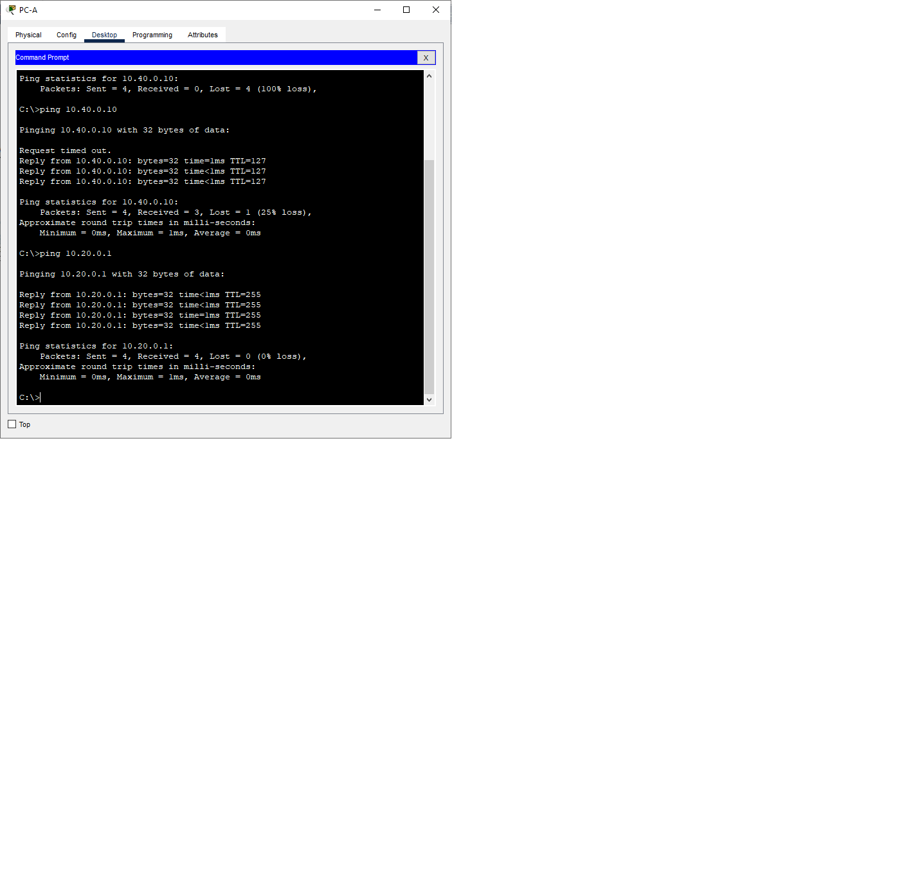
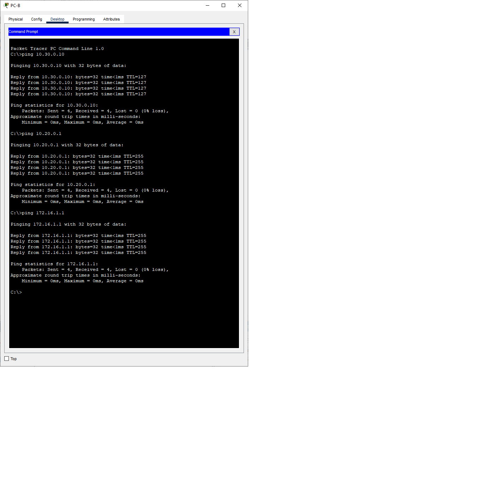
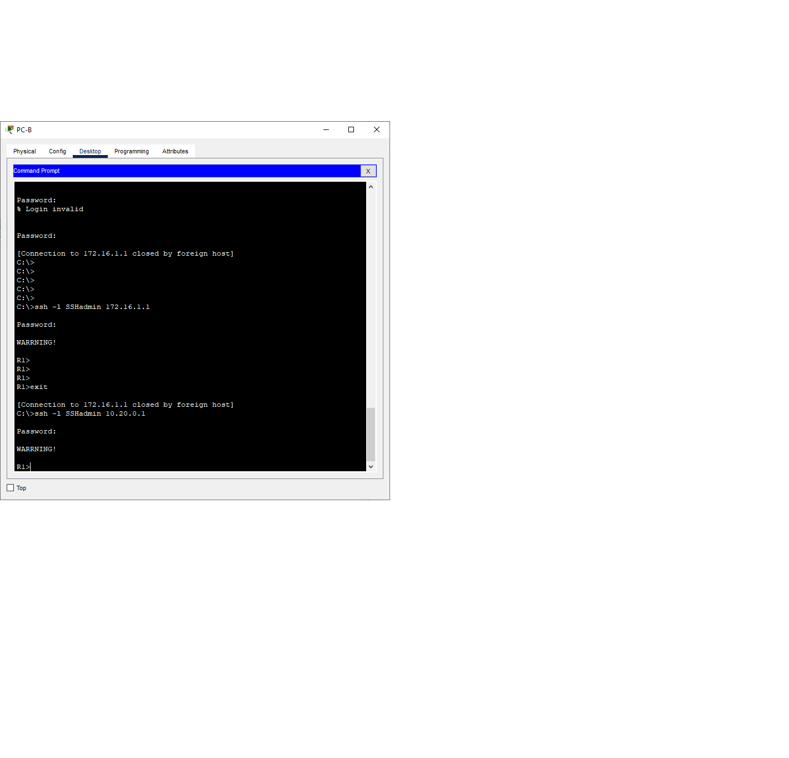
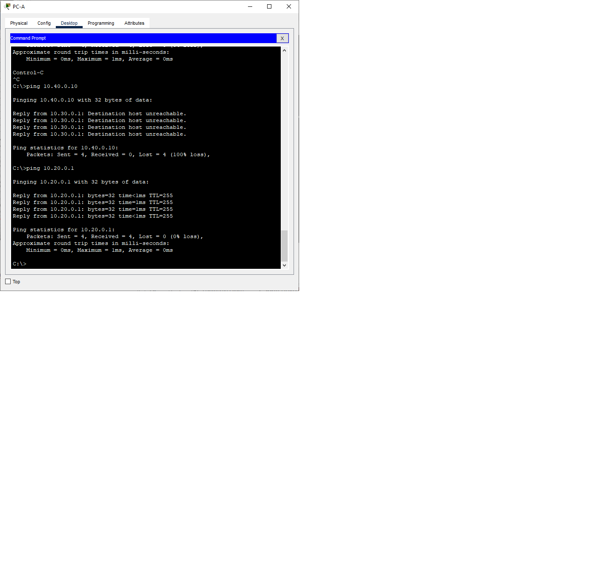

# Лабораторная работа. Настройка и проверка расширенных списков контроля доступа
## Задачи
**Часть 1. Создание сети и настройка основных параметров устройства** 

**Часть 2. Настройка и проверка списков расширенного контроля доступа**
 ***Таблица адресации*** 
  
  
| Устройство |Интерфейс     | IP-адрес      | Маска подсети  | Шлюз по умолчанию|
|------------|--------------|---------------|----------------|------------------|
|    R1      | G 0/0/1      |-              |-               |        -         |
|            | G 0/0/1.20   | 10.20.0.1     |255.255.255.0   |        -         |
|            | G 0/0/1.30   | 10.30.0.1     |255.255.255.0   |        -         |
|            | G 0/0/1.40   | 10.40.0.1     |255.255.255.0   |        -         |
|            | G 0/0/1.1000 | -             |  -             |        -         |
|            | Loopback1    | 172.16.1.1    |255.255.255.0   |        -         |
|    R2      | G 0/0/1      | 10.20.0.4     |255.255.255.0   |        -         |
|    S1      | VLAN 20      | 10.20.0.2     |255.255.255.0   |    10.20.0.1     |
|    S2      | VLAN 20      | 10.20.0.3     |255.255.255.0   |    10.20.0.1     |
|    PC0     | NIC          | 10.30.0.10    |255.255.255.0   |    10.30.0.1     |
|    PC1     | NIC          | 10.40.0.10    |255.255.255.0   |    10.40.0.1     | 
  
  

***Таблица VLAN***      
  

|      VLAN     |    Имя          |   Назначенный интерфейс     | 
|---------------|-----------------|-----------------------------|
|   20          |Management       |  S2: F0/5                   |
|   30          |Operations       |  S1: F0/6                   |
|   40          |Sales            |  S2: F0/18                  |
|   999         |Parking_Lot      |  S1: F0/2-4, F0/7-24,G0/1-2 |
|               |                 |  S2: F0/2-4, F0/6-17,F0/19-24,G0/1-2|
## Ход выполнения работы    
### 1. Создание сети и настройка основных параметров устройств    
Для выполнения работы создадим сеть согласно топологии    
    

Настройка базовых конфигураций  [R1](config/R1_base_setting),[R2](config/base_setting_R2), [S1](config/S1_base_setting), [S2](config/base_setting_S2).    
  
### 2. Настройка сетей VLAN на коммутаторах 
Создадим VLAN коммутаторах в соответствии с таблицей. Настроим интерфейс управления и шлюз по умолчанию на каждом коммутаторе. Все неиспользуемые порты переместим во VLAN 999 и отключим их.
   
    
### 3. Настройте транки (магистральные каналы).
Настроим магистральные порты на коммутаторах  
   
     
### 4. Настройте маршрутизацию.   
Настроим подинтерфейсы для каждой VLAN согласно таблице.  
     
### 5. Настройте удаленный доступ   
Настроим доступ по SHH  
``` 
R1(config)#username SSHadmin privilege 15 secret $cisco123!
R1(config)#ip domain-name ccna-lab.com
R1(config)#crypto key generate rsa
The name for the keys will be: R1.ccna-lab.com
Choose the size of the key modulus in the range of 360 to 2048 for your
  General Purpose Keys. Choosing a key modulus greater than 512 may take
  a few minutes.

How many bits in the modulus [512]: 1024
% Generating 1024 bit RSA keys, keys will be non-exportable...[OK]
R1(config)#ip ssh version 2
R1(config)#line vty 0 4
R1(config-line)#transport input ssh
R1(config-line)#login local
``` 

### 6. Проверка подключения 
Выполним тесты из задания.  
 

 
Как видно, все тесты прошли успешно.    

### 7. Настройка и проверка списков контроля доступа (ACL)  
***Политика 1***  
Сеть Sales не может использовать SSH в сети Management (но в  другие сети SSH разрешен).  
``` 
access-list 110 deny tcp 10.40.0.0 0.0.0.255 10.20.0.0 0.0.0.255 eq 22  
``` 
***Политика 3***    
Сеть Sales не может отправлять эхо-запросы ICMP в сети Operations или Management. Разрешены эхо-запросы ICMP к другим адресатам.  
``` 
R1(config)#access-list 110 deny icmp 10.40.0.0 0.0.0.255 10.30.0.0 0.0.0.255 echo 
R1(config)#access-list 110 deny icmp 10.40.0.0 0.0.0.255 10.20.0.0 0.0.0.255 echo 
``` 
***Политика 4***    
Cеть Operations  не может отправлять ICMP эхозапросы в сеть Sales. Разрешены эхо-запросы ICMP к другим адресатам. 
``` 
R1(config)#access-list 120 deny icmp 10.30.0.0 0.0.0.255 10.40.0.0 0.0.0.255 echo 
``` 
Введем команду *show access-lists* для просмотра статистики
``` 
R1#show access-lists 
Extended IP access list 110
    10 deny tcp 10.40.0.0 0.0.0.255 10.20.0.0 0.0.0.255 eq 22 (24 match(es))
    20 deny icmp 10.40.0.0 0.0.0.255 10.30.0.0 0.0.0.255 echo (4 match(es))
    30 deny icmp 10.40.0.0 0.0.0.255 10.20.0.0 0.0.0.255 echo (4 match(es))
    40 permit ip any any (142 match(es))
Extended IP access list 120
    10 deny icmp 10.30.0.0 0.0.0.255 10.40.0.0 0.0.0.255 echo (17 match(es))
    20 permit ip any any (8 match(es))

R1# 
```   

После создания политик выполним тесты. Результаты выполнения приведены ниже.  
  
  
Результаты соответствуют результатам в методичке. 

Итоговый конфиг [R1](config/R1)
