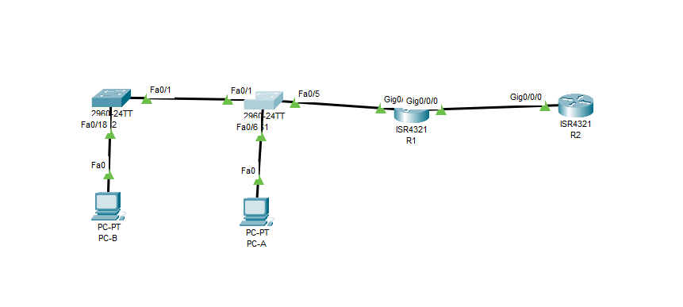
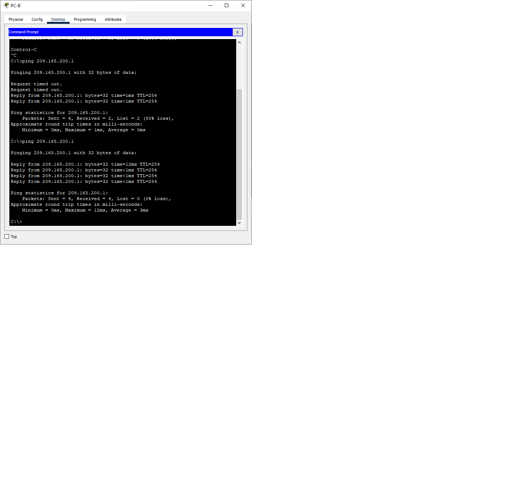
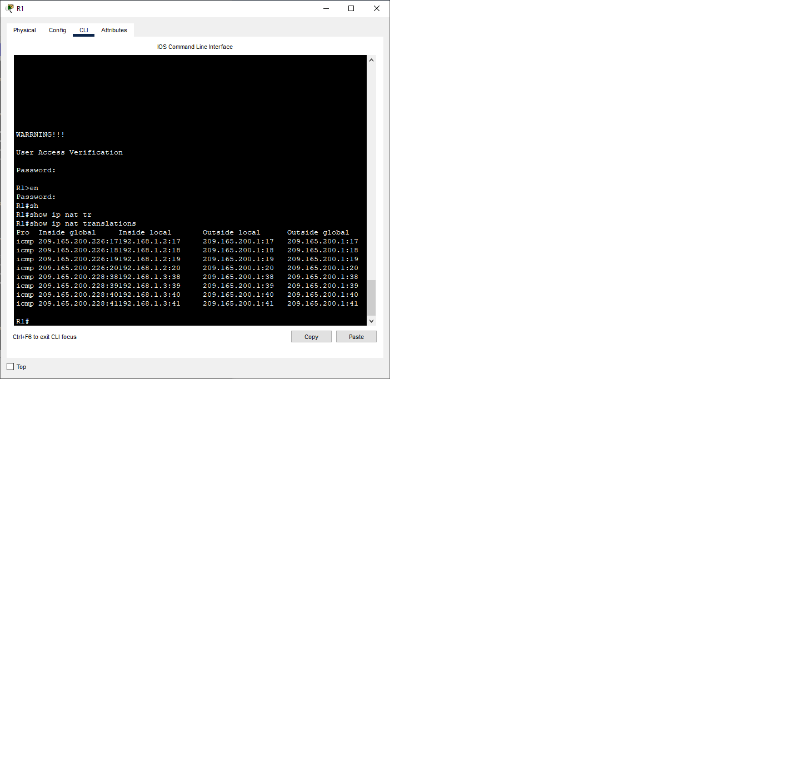
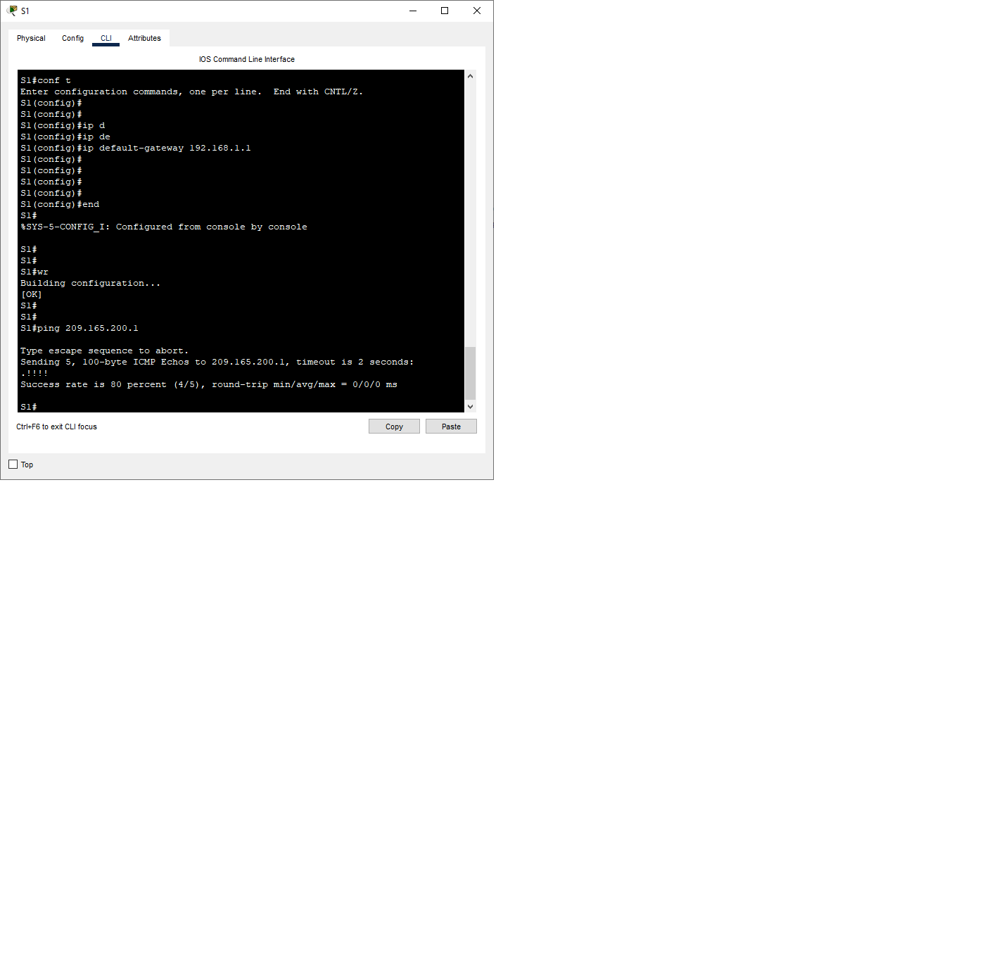
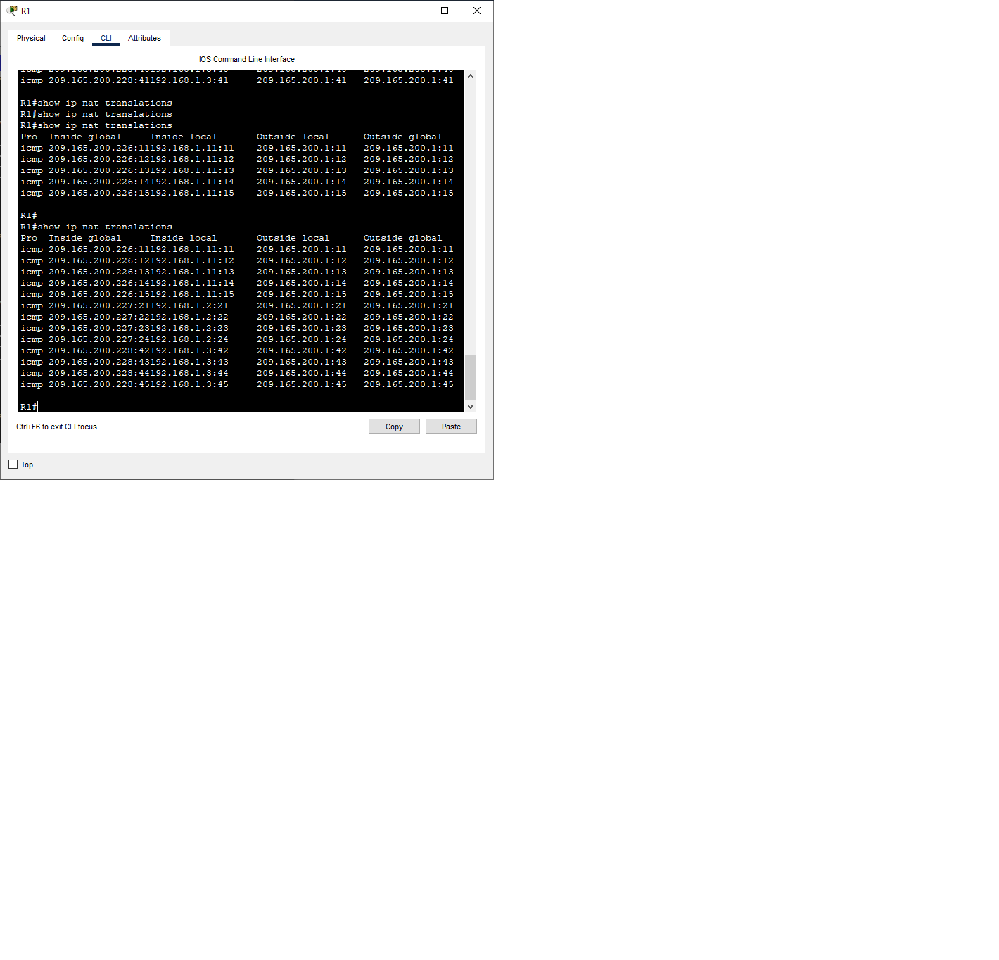
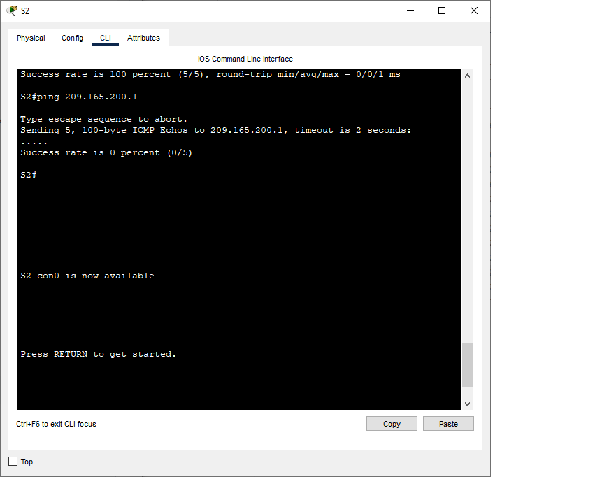

# Лабораторная работа. Настройка и проверка расширенных списков контроля доступа
## Задачи
***Часть 1. Создание сети и настройка основных параметров устройства***
***Часть 2. Настройка и проверка NAT для IPv4***
***Часть 3. Настройка и проверка PAT для IPv4***
***Часть 4. Настройка и проверка статического NAT для IPv4.***

 ***Таблица адресации*** 
  
  
| Устройство |Интерфейс     | IP-адрес      | Маска подсети  | 
|------------|--------------|---------------|----------------|
|    R1      | G 0/0/0      |209.165.200.230|255.255.255.248 | 
|            | G 0/0/1      |192.168.1.1    |255.255.255.0   | 
|    R2      | G 0/0/0      |209.165.200.225|255.255.255.248 | 
|            | Loopback1    |209.165.200.1  |255.255.255.224 | 
|    S1      | VLAN 1       | 192.168.1.11  |255.255.255.0   | 
|    S2      | VLAN 1       | 192.168.1.12  |255.255.255.0   | 
|    PC-A    | NIC          | 192.168.1.2   |255.255.255.0   | 
|    PC1     | NIC          | 192.168.1.3   |255.255.255.0   |    

## Ход выполнения работы    
### 1. Создание сети и настройка основных параметров устройств    
Для выполнения работы создадим сеть согласно топологии    
    

Настройка базовых конфигураций  [R1](config/R1),[R2](config/R2), [S1](config/S1), [S2](config/S2).      

### 2. Настройка и проверка NAT для IPv4. 
***Шаг 1***
Настроим простой список доступа, который определяет, какие хосты будут разрешены для трансляции.  
Затем создадим пул NAT и укажем ему имя и диапазон используемых адресов.  
Настроим перевод, связывая ACL и пул с процессом преобразования.  
После этого зададим внутренний и внешний интерфейсы.  
``` 
R1(config)#access-list 1 permit 192.168.1.0 0.0.0.255
R1(config)#ip nat pool PUBLIC_ACCESS 209.165.200.226 209.165.200.228 netmask 255.255.255.248
R1(config)#ip nat inside source list 1 pool PUBLIC_ACCESS
R1(config)#interface g0/0/1
R1(config-if)#ip nat inside 
R1(config-if)#int g0/0/0
R1(config-if)#ip nat outside  
``` 
***Шаг 2*** 
Проверим конфигурацию.  
С PC-B  запустим эхо-запрос интерфейса Lo1 (209.165.200.1) на R2. Эхо-запрос не прошел, т.к. на хостах не указан шлюз по умолчанию (данная проблема также устранена и в следующих хостах). После настройки эхо-запрос прошел удачно.
На R1 отобразим таблицу NAT на с помощью команды *show ip nat translations*.  
  
  
Внутренний локальный адрес был транслирован в *209.165.200.226*.  
 Аналогичное действие проведем и с PC-A, S1, S2:  
***PC-A***
  
  
***S1***  
  
      
***S2***  
    
Пинг с S2 завершился неудачей, т.к. в пуле всего 3 адреса, а мы посылали эхо-запросы с четырех устройств.
