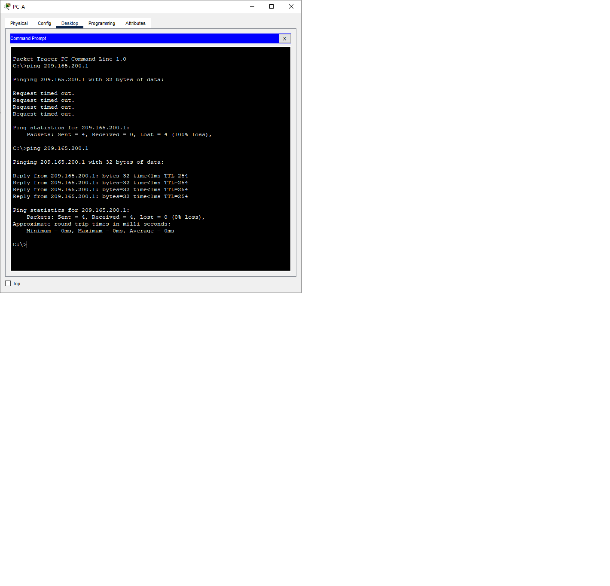

# Лабораторная работа. Настройка NAT для IPv4
## Задачи
***Часть 1. Создание сети и настройка основных параметров устройства*** 

***Часть 2. Настройка и проверка NAT для IPv4***  

***Часть 3. Настройка и проверка PAT для IPv4***  

***Часть 4. Настройка и проверка статического NAT для IPv4.***  


 ***Таблица адресации*** 
  
  
| Устройство |Интерфейс     | IP-адрес      | Маска подсети  | 
|------------|--------------|---------------|----------------|
|    R1      | G 0/0/0      |209.165.200.230|255.255.255.248 | 
|            | G 0/0/1      |192.168.1.1    |255.255.255.0   | 
|    R2      | G 0/0/0      |209.165.200.225|255.255.255.248 | 
|            | Loopback1    |209.165.200.1  |255.255.255.224 | 
|    S1      | VLAN 1       | 192.168.1.11  |255.255.255.0   | 
|    S2      | VLAN 1       | 192.168.1.12  |255.255.255.0   | 
|    PC-A    | NIC          | 192.168.1.2   |255.255.255.0   | 
|    PC1     | NIC          | 192.168.1.3   |255.255.255.0   |    

## Ход выполнения работы    
### 1. Создание сети и настройка основных параметров устройств    
Для выполнения работы создадим сеть согласно топологии    
    

Настройка базовых конфигураций  [R1](config/R1),[R2](config/R2), [S1](config/S1), [S2](config/S2).      

### 2. Настройка и проверка NAT для IPv4. 
***Шаг 1***
Настроим простой список доступа, который определяет, какие хосты будут разрешены для трансляции.  
Затем создадим пул NAT и укажем ему имя и диапазон используемых адресов.  
Настроим перевод, связывая ACL и пул с процессом преобразования.  
После этого зададим внутренний и внешний интерфейсы.  
``` 
R1(config)#access-list 1 permit 192.168.1.0 0.0.0.255
R1(config)#ip nat pool PUBLIC_ACCESS 209.165.200.226 209.165.200.228 netmask 255.255.255.248
R1(config)#ip nat inside source list 1 pool PUBLIC_ACCESS
R1(config)#interface g0/0/1
R1(config-if)#ip nat inside 
R1(config-if)#int g0/0/0
R1(config-if)#ip nat outside  
``` 
***Шаг 2*** 
Проверим конфигурацию.  
С PC-B  запустим эхо-запрос интерфейса Lo1 (209.165.200.1) на R2. Эхо-запрос не прошел, т.к. на хостах не указан шлюз по умолчанию (данная проблема также устранена и в следующих хостах). После настройки эхо-запрос прошел удачно.
На R1 отобразим таблицу NAT на с помощью команды *show ip nat translations*.  
  
  
Внутренний локальный адрес был транслирован в *209.165.200.226*.  
 Аналогичное действие проведем и с PC-A, S1, S2:  
***PC-A***
  
  
***S1***  
  
      
***S2***  
    
Пинг с S2 завершился неудачей, т.к. в пуле всего 3 адреса, а мы посылали эхо-запросы с четырех устройств. 
### 3. Настройка и проверка PAT 
Для выполнения этой части задания выполним команду  
*no ip nat inside source list 1 pool PUBLIC_ACCESS* 
И включим PAT 
``` 
R1(config)# ip nat inside source list 1 pool PUBLIC_ACCESS overload   
``` 
Отправим эхо-запрос с PC-B на Loopback R2 и увидим, что всe проходит:  

Внутренний локальный адрес был преобразован в 209.165.200.226 
Тоже самое произойдет, если мы отправим эхо-запрос с PC-A:  
  
На скрине можно увидеть, что адреса двух хостов преобразуются в один, отличаются они только значением порта.  
  
  **Теперь рассмотрим PAT с перегрузкой интерфейса**  
  Выполним следующее: 
```   
R1(config)# no ip nat inside source list 1 pool PUBLIC_ACCESS overload 
R1(config)# no ip nat pool PUBLIC_ACCESS
R1(config)# ip nat inside source list 1 interface g0/0/0 overload   
``` 
Проверить работу PAT можно, запустив эхо-запросы с PC-A, PC-B, S1, S2 одновременно, а на R1 выполним команду *show ip nat translations*:  
``` 
R1#show ip nat translations 
Pro  Inside global        Inside local       Outside local      Outside global
icmp 209.165.200.230:1024 192.168.1.2:205    209.165.200.1:205  209.165.200.1:1024
icmp 209.165.200.230:1025 192.168.1.2:206    209.165.200.1:206  209.165.200.1:1025 
icmp 209.165.200.230:1068 192.168.1.12:2     209.165.200.1:2    209.165.200.1:1068
icmp 209.165.200.230:1069 192.168.1.12:3     209.165.200.1:3    209.165.200.1:1069 
icmp 209.165.200.230:10   192.168.1.11:10    209.165.200.1:10   209.165.200.1:10 
icmp 209.165.200.230:289  192.168.1.3:289    209.165.200.1:289  209.165.200.1:289
icmp 209.165.200.230:290  192.168.1.3:290    209.165.200.1:290  209.165.200.1:290
``` 
Видно, что все локальные адреса устройств были преобразованы в глобальный.  
  
### 4. Настройка и проверка статического NAT для IPv4.  
Настроим статический NAT таким образом, чтобы PC-A был доступен напрямую из Интернета. PC-A будет доступен из R2 по адресу 209.165.200.229. 
``` 
R1(config)# ip nat inside source static 192.168.1.2 209.165.200.229   
``` 
 Выполним команду *show ip nat translations* и увидим статическое сопоставление:  
   
Теперь проверим отправим эхо-запрос из R2 к PC-A, использую внутренний глобальный адрес:  
 
Пинги проходят. 
На R1 отобразим таблицу NAT с помощью команды *show ip nat translations*, и вы увидим статическое сопоставление и преобразование на уровне порта для входящих pings.  
 


