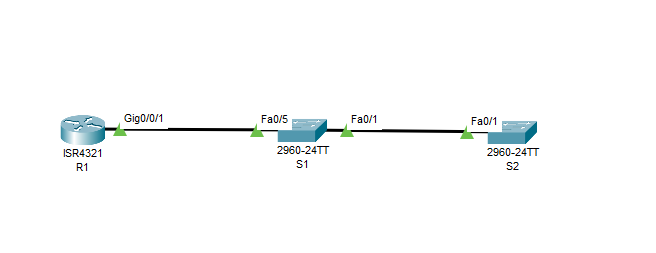
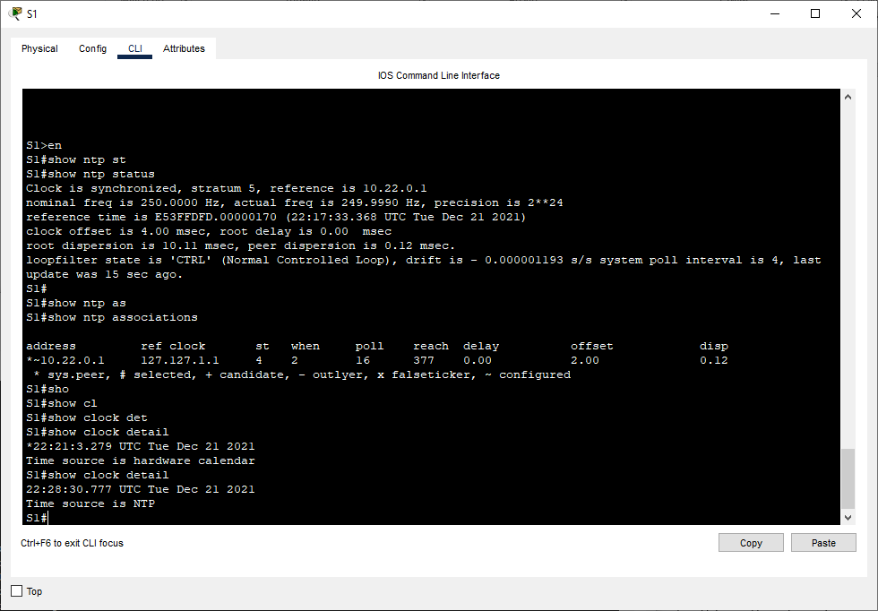
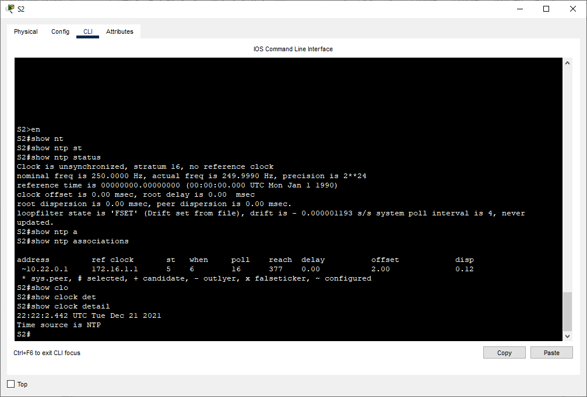

# Лабораторная работа. Настройка протоколов CDP, LLDP и NTP.
## Задачи
***Часть 1. Создание сети и настройка основных параметров устройства***
***Часть 2. Обнаружение сетевых ресурсов с помощью протокола CDP***
***Часть 3. Обнаружение сетевых ресурсов с помощью протокола LLDP***
***Часть 4. Настройка и проверка NTP***


 ***Таблица адресации*** 
  
  
| Устройство |Интерфейс     | IP-адрес      | Маска подсети  | 
|------------|--------------|---------------|----------------|
|    R1      | Loopback1    | 172.16.1.1    |255.255.255.0   | 
|            | G 0/0/1      | 10.22.0.1     |255.255.255.0   | 
|    S1      | SVI VLAN 1   | 10.22.0.2     |255.255.255.0   | 
|    S2      | SVI VLAN 1   | 10.22.0.3     |255.255.255.0   | 
 

## Ход выполнения работы    
### 1. Создание сети и настройка основных параметров устройств    
Для выполнения работы создадим сеть согласно топологии    
    

### 2. Обнаружение сетевых ресурсов с помощью протокола CDP   

С помощью команды *show cdp int* можно увидеть, что на R1 CDP включено на интерфейсе g0/0/1 
``` 
R1(config)#do show cdp int
Vlan1 is administratively down, line protocol is down
  Sending CDP packets every 60 seconds
  Holdtime is 180 seconds
GigabitEthernet0/0/0 is administratively down, line protocol is down
  Sending CDP packets every 60 seconds
  Holdtime is 180 seconds
GigabitEthernet0/0/1 is up, line protocol is up
  Sending CDP packets every 60 seconds
  Holdtime is 180 seconds 
``` 
Определим версию IOS, используемую на S1: 
``` 
R1#show cdp entry S1

Device ID: S1
Entry address(es): 
Platform: cisco 2960, Capabilities: Switch
Interface: GigabitEthernet0/0/1, Port ID (outgoing port): FastEthernet0/5
Holdtime: 144

Version :
Cisco IOS Software, C2960 Software (C2960-LANBASEK9-M), Version 15.0(2)SE4, RELEASE SOFTWARE (fc1)
Technical Support: http://www.cisco.com/techsupport
Copyright (c) 1986-2013 by Cisco Systems, Inc.
Compiled Wed 26-Jun-13 02:49 by mnguyen

advertisement version: 2
Duplex: full  
``` 

Настроим SVI на коммутаторах и выполним команду *show cdp entry S1* на R1:  
``` 
R1#show cdp entry S1

Device ID: S1
Entry address(es): 
  IP address : 10.22.0.2
Platform: cisco 2960, Capabilities: Switch
Interface: GigabitEthernet0/0/1, Port ID (outgoing port): FastEthernet0/5
Holdtime: 168

Version :
Cisco IOS Software, C2960 Software (C2960-LANBASEK9-M), Version 15.0(2)SE4, RELEASE SOFTWARE (fc1)
Technical Support: http://www.cisco.com/techsupport
Copyright (c) 1986-2013 by Cisco Systems, Inc.
Compiled Wed 26-Jun-13 02:49 by mnguyen

advertisement version: 2
Duplex: full    
```   
Теперь мы можем увидеть IP-адрес соседа.  
  
Отключим глобально CDP:  
``` 
R1(config)#no cdp run
R1(config)#
R1(config)#
R1(config)#
R1(config)#do show cdp
% CDP is not enabled  
```   

### 3. Обнаружение сетевых ресурсов с помощью протокола LLDP. 
Включим LLDP на всех устройствах топологии и выполним команду на S1 *show lldp neighbors detail* для вывода детальной информации о всех соседях:
``` 
S1#show lldp neighbors detail 
------------------------------------------------
Chassis id: 0000.0C0E.8601
Port id: Fa0/1
Port Description: FastEthernet0/1
System Name: S2
System Description:
Cisco IOS Software, C2960 Software (C2960-LANBASEK9-M), Version 15.0(2)SE4, RELEASE SOFTWARE (fc1)
Technical Support: http://www.cisco.com/techsupport
Copyright (c) 1986-2013 by Cisco Systems, Inc.
Compiled Wed 26-Jun-13 02:49 by mnguyen
Time remaining: 90 seconds
System Capabilities: B
Enabled Capabilities: B
Management Addresses - not advertised
Auto Negotiation - supported, enabled
Physical media capabilities:
    100baseT(FD)
    100baseT(HD)
    1000baseT(HD)
Media Attachment Unit type: 10
Vlan ID: 1
------------------------------------------------
Chassis id: 00E0.B070.A502
Port id: Gig0/0/1
Port Description: GigabitEthernet0/0/1
System Name: R1
System Description:
Cisco IOS XE Software, Version 03.13.04.S - Extended Support Release
Cisco IOS Software, ISR Software (X86_64_LINUX_IOSD-UNIVERSALK9-M), Version 15.5(3)S5, RELEASE SOFTWARE (fc2)
Technical Support: http://www.cisco.com/techsupport
Copyright (c) 1986-2017 by Cisco Systems, Inc.
Compiled Mon 05-Oct-15 11:24 by mcpre
Time remaining: 90 seconds
System Capabilities: R
Enabled Capabilities: R
Management Addresses - not advertised
Auto Negotiation - supported, enabled
Physical media capabilities:
    1000baseT(HD)
    100baseT(FD)
Media Attachment Unit type: 10
Vlan ID: 1

Total entries displayed: 2 
``` 
### 4. Настройка и проверка NTP
Выведем на экран текущее время на R1: 
``` 
R1#show clock detail 
*0:43:42.2 UTC Mon Mar 1 1993
Time source is hardware calendar    
``` 
Теперь настроим:  
```
R1#clock set 20:45:55 DECEMBER 21 2021  
R1(config)#ntp master 4
``` 

Выполним *show clock detail* после настройки: 
```  
20:48:8.138 UTC Tue Dec 21 2021
Time source is NTP
``` 
Проверим время на S1 и S2:
``` 
S1#show clock detail 
*0:43:32.121 UTC Mon Mar 1 1993
Time source is hardware calendar  
``` 

``` 
S2#show clock detail 
*0:44:12.121 UTC Mon Mar 1 1993
Time source is hardware calendar  
```   
Настроим сервер NTP на коммутаторах и выполним команду *show clock detail*:
``` 
S1(config)#ntp server 10.22.0.1
S1#show clock detail 
*22:21:3.279 UTC Tue Dec 21 2021
Time source is hardware calendar
``` 
``` 
S2(config)#ntp server 10.22.0.1
S2#show clock detail 
*22:22:2.442 UTC Tue Dec 21 2021
Time source is hardware calendar
```   
   
 
