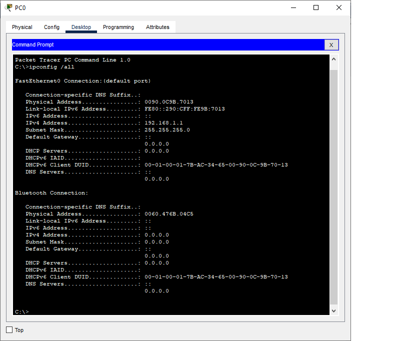
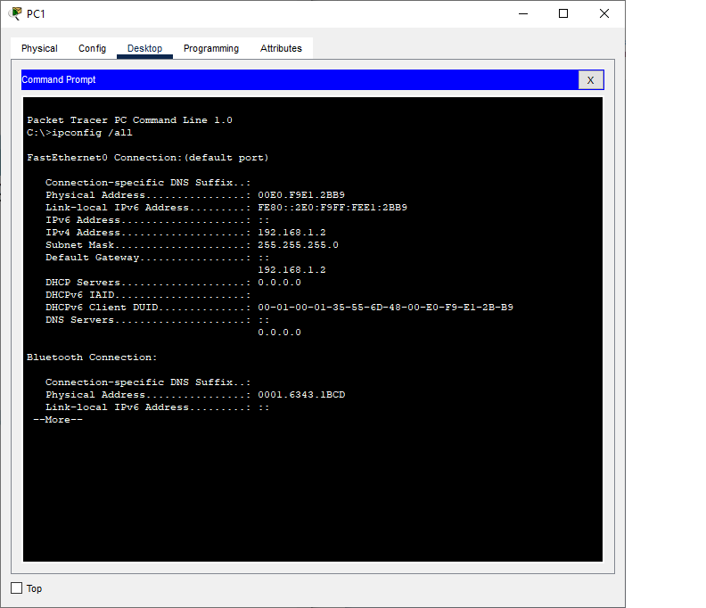
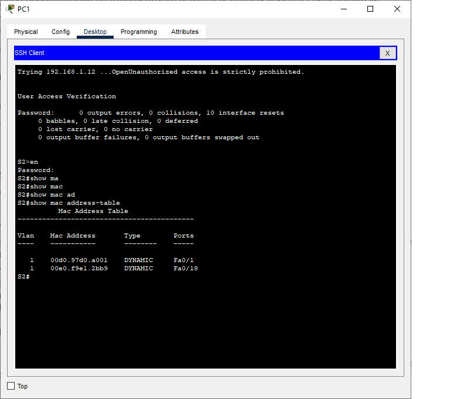
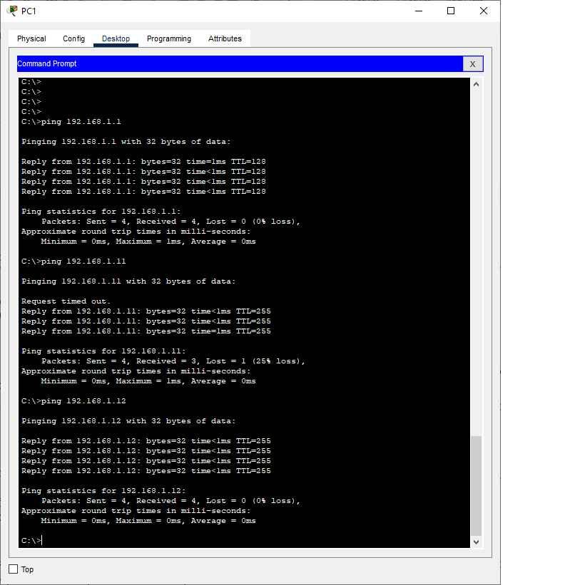
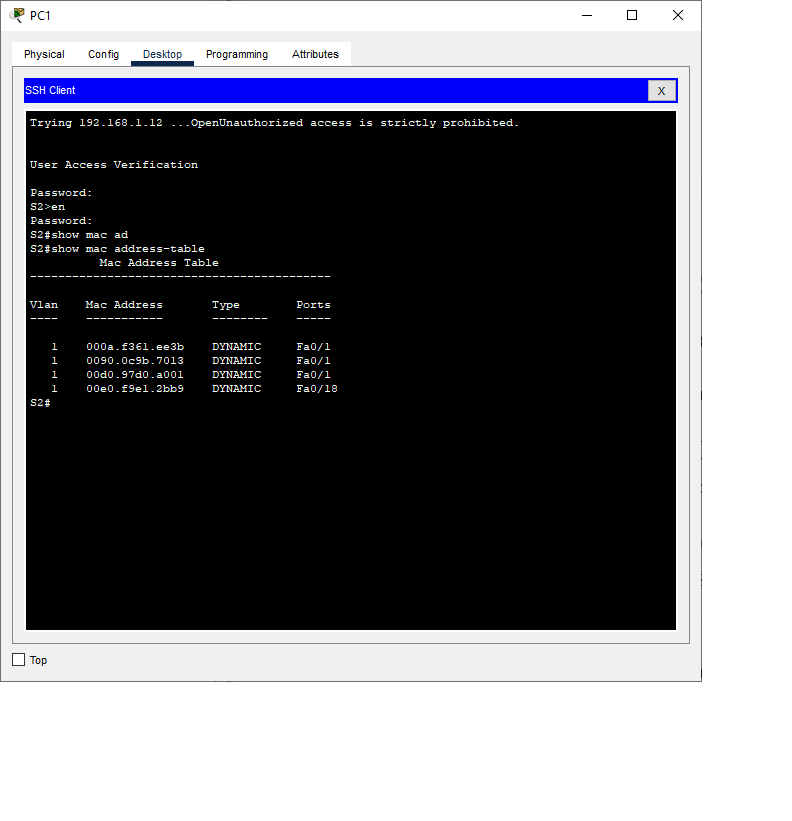

# Лабораторная работа. Просмотр таблицы MAC-адресов коммутатора
## Задачи
1. **Создание и настройка сети**
2. **Изучение таблицы MAC-адресов**
## Ход выполнения работы
1. ### Создание и настройка сети
1.1 **Создадим сеть в соответсвии с топологией**   
1.2 **Настроим узлы PC**    
  
1.3 **Выполним инициализацию и перезагрузку коммутаторов**  
1.4 **Настроим базовые параметры каждого коммутатора**  
Настроим имена устройств, IP-адреса, а также пароли для доступа к привилегированному режиму, консоли и VTY  
[Конфигурация](config/base_setting_S1) коммутатора S1.  
[Конфигурация](config/base_setting_S2) коммутатора S2.  
  
**2. Изучение таблицы MAC-адрксов коммутатора** 

**2.1 a)** С помощью команды ipconfig /all в командной строке обоих компьютеров посмотрим физические адреса адаптеров Ethernet  
 


Таблица MAC-адресов.

| № п/п |Имя компьютера  | MAC-адрес      | 
|------:|:---------------|---------------:|
|    1  | PC0            | 0090.0C9B.7013 | 
|    2  | PC1            | 00E0.F9E1.2BB9 | 

**b)** С помощью консоли подключимся к каждому из коммутаторов и введем команду show interface F0/1
| № п/п |Имя коммутатора | Интерфейс         | MAC-адрес      |
|------:|:---------------|------------------:|---------------:|
|    1  | S1             | Fast Ethernet 0/1 |00d0.97d0.a001  | 
|    2  | S2             | Fast Ethernet 0/1 |0090.2105.4b01  | 

**2.2 Изучим таблицу MAC-адресов**  

**a)** С помощью консоли подключимся к коммутатору S2 и войдем в привилегированный режим  

**b)** Введем команду show mac address-table

Из полученных данных можно сделать вывод, что первый MAC-адрес принадлежит коммутатору S2, а второй компьютеру PC1.
Принадлежность MAC-адреса также можно узнать, посмотрев, к какому порту подключено устройство.  

**2.3** 
После очистки таблицы с помощью команды clear mac address-table dynamic изменений не произошло.
Физического адреса для VLAN1 обнаружено небыло.

**2.4**
**a)** На компьютере PC1 в cmd введем команду arp -a
```C:\>arp -a
   Internet Address      Physical Address      Type
   192.168.1.12          000a.f3ca.4ec3        dynamic
```
Мы видим один адресс, который принадлежит VLAN1 коммутатора S2. 

**b)** Из cmd PC1 отправим эхо-запросы на PC0, S1, S2 
 
Ответы получены от всех устройств.  

**c)** Подключившись через консоль к S2, введем команду show mac address-table
  
Мы видим, что в таблицу добавились адреса PC0, 1-го порта коммутатора S1, а также VLAN1 коммутатора S1. 
Также на PC1 в cmd введем команду arp -a: 

```
C:\>arp -a
  Internet Address      Physical Address      Type
  192.168.1.1           0090.0c9b.7013        dynamic
  192.168.1.11          000a.f361.ee3b        dynamic
  192.168.1.12          000a.f3ca.4ec3        dynamic
``` 
В arp-кэше PC1 появились записи всех сетевых устройст, которым были отправлены запросы.
