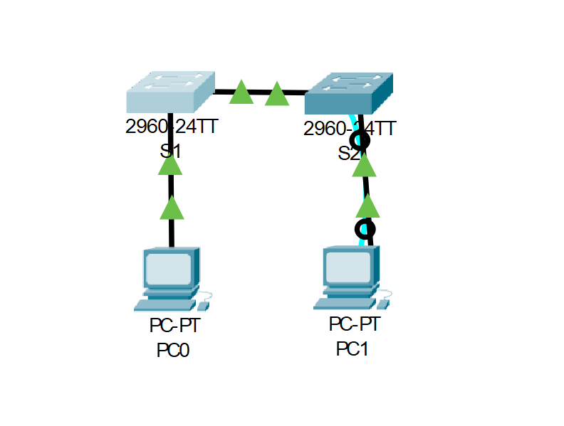

# Лабораторная работа. Просмотр таблицы MAC-адресов коммутатора
## Задачи
1. **Создание и настройка сети**
2. **Изучение таблицы MAC-адресов**
## Ход выполнения работы
1. ### Создание и настройка сети
1.1 **Создадим сеть в соответсвии с топологией**

