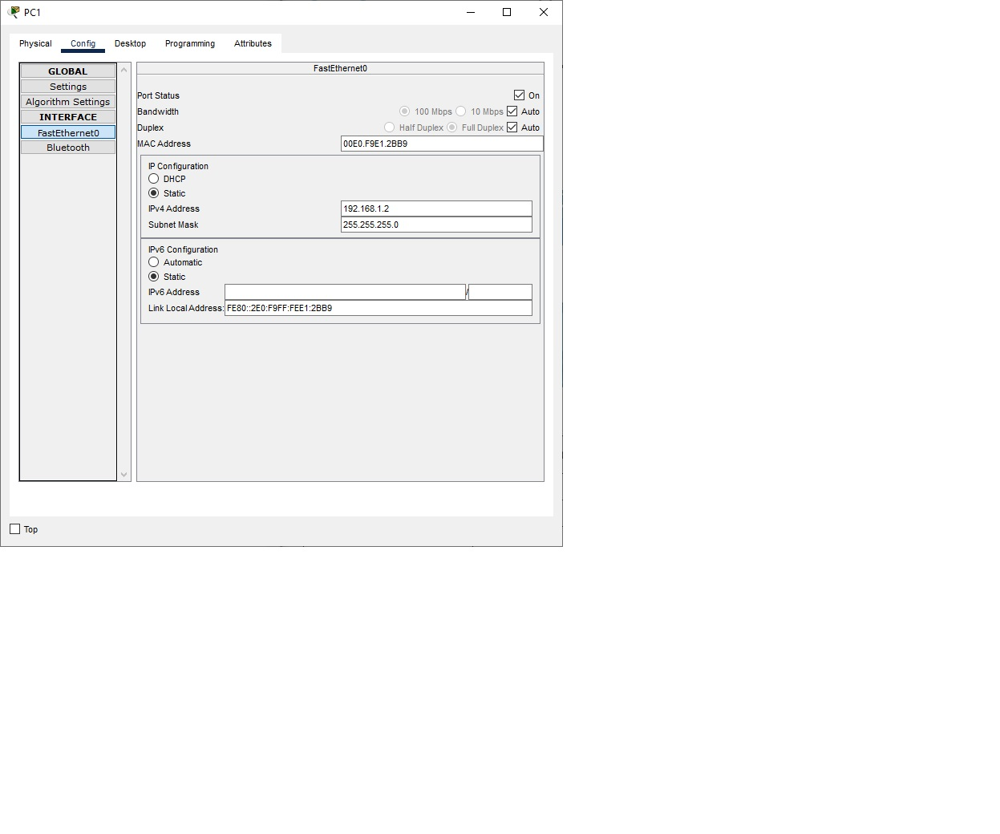

# Лабораторная работа. Просмотр таблицы MAC-адресов коммутатора
## Задачи
1. **Создание и настройка сети**
2. **Изучение таблицы MAC-адресов**
## Ход выполнения работы
1. ### Создание и настройка сети
1.1 **Создадим сеть в соответсвии с топологией**   
1.2 **Настроим узлы PC**    
  
1.3 **Выполним инициализацию и перезагрузку коммутаторов**  
1.4 **Настроим базовые параметры каждого коммутатора**  
a. Настроим имена устройств в соответствии с заданием
