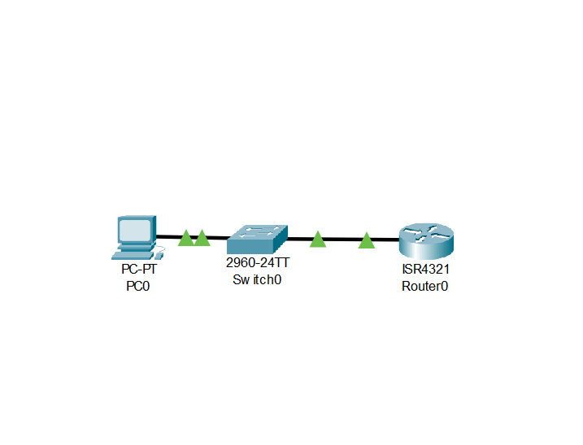
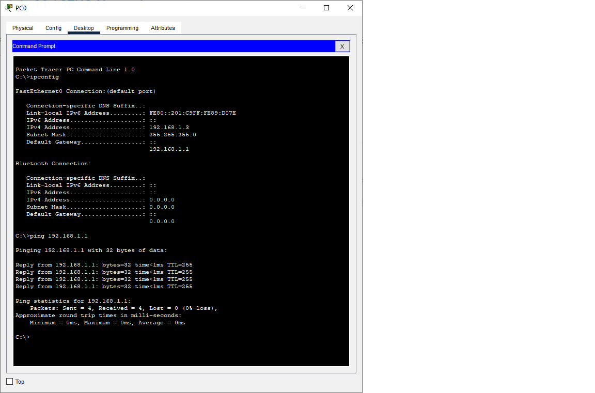
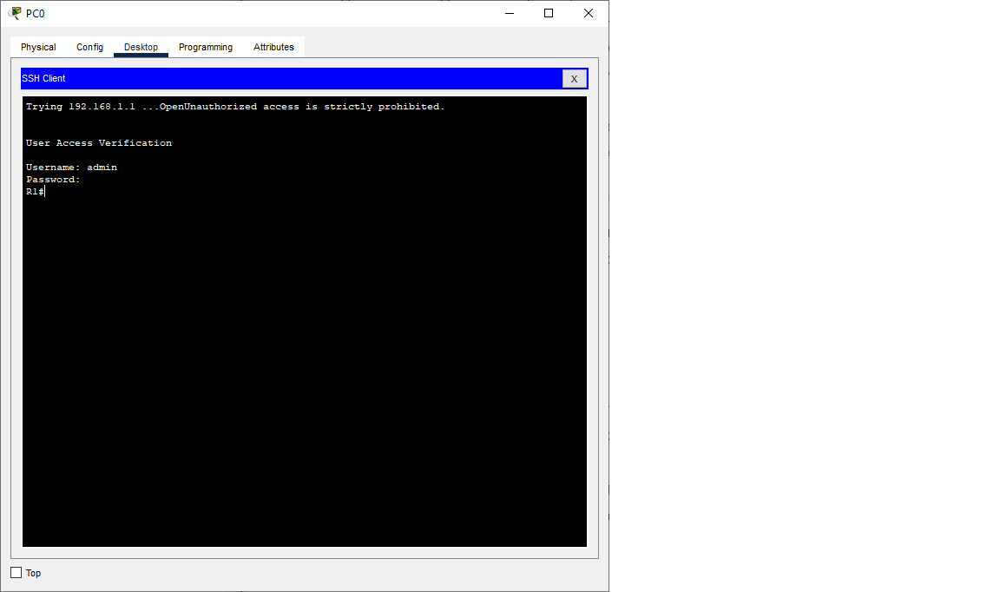
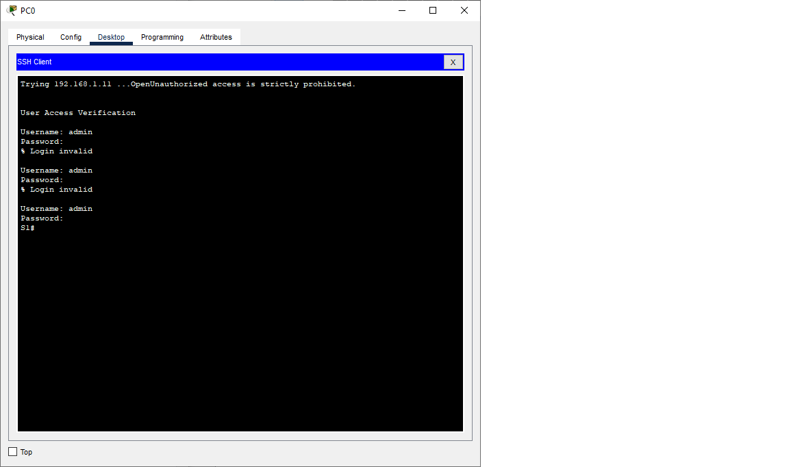

# Лабораторная работа. Доступ к сетевым устройствам по протоколу SSH
## Задачи
1. Настройка основных параметров устройства
2. Настройка маршрутизатора для доступа по протоколу SSH
3. Настройка коммутатора для доступа по протоколу SSH
4. SSH через интерфейс командной строки (CLI) коммутатора     


  **Таблица адресации**   
  
| Устройство |Интерфейс    | IP-адрес     | Маска подсети  | Шлюз по умолчанию|
|------------|-------------|--------------|----------------|------------------|
|    R1      | G 0/0/1     | 192.168.1.1  |255.255.255.0   |        -         |
|    S1      | VLAN1       | 192.168.1.11 |255.255.255.0   |    192.168.1.1   |
|    PC      | NIC         | 192.168.1.3  |255.255.255.0   |    192.168.1.1   |

## Ход выполнения работы    
### 1. Настройка основных параметров устройств    
Создали сеть согласно заданию:  
 

Провели настройку основных параметров маршрутизатора R1. Конфигурацию можно посмотреть 
[здесь](config/base_setting_R1).  

Также провели настройку компьютера PC0 и проверили связь с маршрутизатором R1 c помощью команды ping:   


  

### 2. Настройка маршрутизатора для доступа по протоколу SSH   
#### 2.1 Настройка аутентификации устройств 
***a)*** Имя устройства было задано при первоначальной настройке маршрутизатора.  
***b)*** Зададим имя домена для устройства:  
``` 
R1(config)#ip domain-name cisco.com 
``` 

#### 2.2 Создадим ключ шифрования с указанием его длины.  
```
R1(config)#crypto key generate rsa 
The name for the keys will be: R1.cisco.com
Choose the size of the key modulus in the range of 360 to 2048 for your
  General Purpose Keys. Choosing a key modulus greater than 512 may take
  a few minutes.

How many bits in the modulus [512]: 512
% Generating 512 bit RSA keys, keys will be non-exportable...[OK]

R1(config)#
```  
#### 2.3 Создадим имя пользователя в локальной базе учетных записей.  
```
R1(config)#username admin privilege 15 secret Adm1nP@55
```  

#### 2.4 Активируем протокол SSH на линиях VTY.  
***a)*** Активируем протоколы Telnet и SSH на входящих линиях VTY:  
```
R1(config)#line vty 0 4
R1(config-line)#tra
R1(config-line)#transport in
R1(config-line)#transport input te
R1(config-line)#transport input telnet ss
R1(config-line)#transport input telnet ssh
                                       ^
% Invalid input detected at '^' marker.
	
R1(config-line)#transport input ssh
R1(config-line)#transport input tel
R1(config-line)#transport input telnet 
R1(config-line)#
```  

***b)*** Изменим способ входа в систему так, чтобы использовалась проверка пользователей по локальной базе учетных записей:	
```	
R1(config-line)#login local			
```

#### 2.5 Сохраним текущую конфигурацию.		
```

R1#copy running-config startup-config 
Destination filename [startup-config]? 
Building configuration...
[OK]
R1#	
```

#### 2.6 Установим соединение с маршрутизатором по протоколу SSH.		
 

### 3. Настройка коммутатора для доступа по протоколу SSH   	
#### 3.1 Настроим основные параметры коммутатора.		
Конфигурацию можно посмотреть [здесь](config/base_setting_S1)		


#### 3.2 Настроим коммутатор для соединения по протоколу SSH.		
***a)*** Имя устройство было задано при начальной настройке.		
***b)*** Зададим имя домена для устройства.
```
S1(config)#ip domain-name cisco.com
```
***c)*** Создадим ключ шифрования с указанием его длины.
```
S1(config)#crypto key generate rsa
The name for the keys will be: S1.cisco.com
Choose the size of the key modulus in the range of 360 to 2048 for your
  General Purpose Keys. Choosing a key modulus greater than 512 may take
  a few minutes.

How many bits in the modulus [512]: 512
% Generating 512 bit RSA keys, keys will be non-exportable...[OK]

S1(config)#
```
***d)*** Создадим имя пользователя в локальной базе учетных записей:		
```
R1(config)#username admin privilege 15 secret Adm1nP@55
```
***e)*** Активируем протоколы Telnet и SSH на линиях VTY:	
```
S1(config-line)#transport input ssh
S1(config-line)#transport input telnet
```
***f)*** Изменим способ входа в систему так, чтобы использовалась проверка пользователей по локальной базе учетных записей:	
```	
R1(config-line)#login local			

```

#### 3.3 Установим соединение с маршрутизатором по протоколу SSH.		
 
