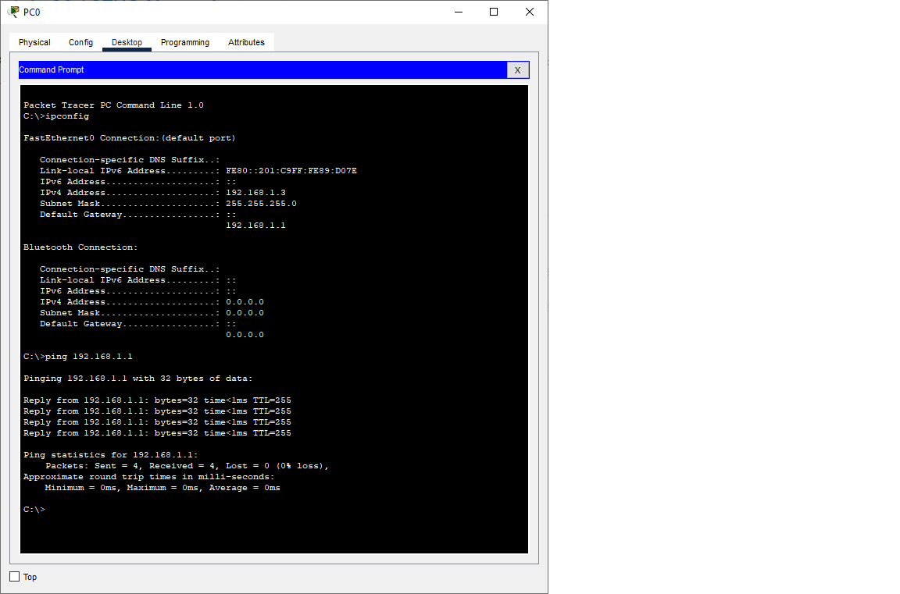

# Лабораторная работа. Доступ к сетевым устройствам по протоколу SSH
## Задачи
1. Настройка основных параметров устройства
2. Настройка маршрутизатора для доступа по протоколу SSH
3. Настройка коммутатора для доступа по протоколу SSH
4. SSH через интерфейс командной строки (CLI) коммутатора     

  **Таблица адресации**   
  
| Устройство |Интерфейс    | IP-адрес     | Маска подсети  | Шлюз по умолчанию|
|------------|-------------|--------------|----------------|------------------|
|    R1      | G 0/0/1     | 192.168.1.1  |255.255.255.0   |        -         |
|    S1      | VLAN1       | 192.168.1.11 |255.255.255.0   |    192.168.1.1   |
|    PC      | NIC         | 192.168.1.3  |255.255.255.0   |    192.168.1.1   |

## Ход выполнения работы    
### 1. Настройка основных параметров устройств    
Создали сеть согласно заданию:  
 

Провели настройку основных параметров маршрутизатора R1. Конфигурацию можно посмотреть 
[здесь](config/base_setting_R1).  

Также провели настройку компьютера PC0 и проверили связь с маршрутизатором R1 c помощью команды ping: 

