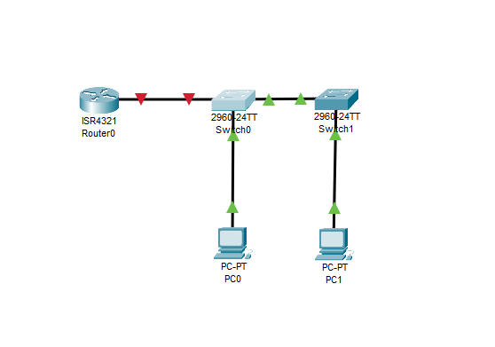
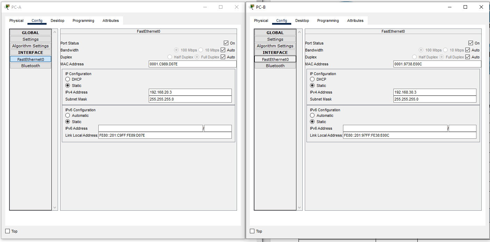

# Лабораторная работа. Внедрение маршрутизации между виртуальными локальными сетями
## Задачи
**1. Создание сети и настройка основных параметров устройства** 

**2. Создание сетей VLAN и назначение портов коммутатора**  

**3. Настройка транка 802.1Q между коммутаторами.** 

**4. Настройка маршрутизации между сетями VLAN**  

**5. Проверка, что маршрутизация между VLAN работает**  
  
    
     
      
  ***Таблица адресации*** 
  
  
| Устройство |Интерфейс     | IP-адрес      | Маска подсети  | Шлюз по умолчанию|
|------------|--------------|---------------|----------------|------------------|
|    R1      | G 0/0/1.10   | 192.168.10.1  |255.255.255.0   |        -         |
|            | G 0/0/1.20   | 192.168.10.1  |255.255.255.0   |        -         |
|            | G 0/0/1.30   | 192.168.10.1  |255.255.255.0   |        -         |
|            | G 0/0/1.1000 | -             |  -             |        -         |
|    S1      | VLAN 10      | 192.168.10.11 |255.255.255.0   |    192.168.10.1  |
|    S2      | VLAN 10      | 192.168.10.12 |255.255.255.0   |    192.168.10.1  |
|    PC0     | NIC          | 192.168.20.3  |255.255.255.0   |    192.168.20.1  |
|    PC1     | NIC          | 192.168.30.3  |255.255.255.0   |    192.168.30.1  | 
  
  

***Таблица VLAN***      
  

|      VLAN     |    Имя          |   Назначенный интерфейс     | 
|---------------|-----------------|-----------------------------|
|   10          |Управление       |  S1: VLAN 10                |
|               |                 |  S2: VLAN 10                |
|   20          |Sales            |  S1: F0/6                   |
|   30          |Operations       |  S2: F0/18                  |
|   999         |Parking_Lot      |  С1: F0/2-4, F0/7-24,G0/1-2 |
|               |                 |  С2: F0/2-17,F0/19-24,G0/1-2|
            
               


## Ход выполнения работы    
### 1. Создание сети и настройка основных параметров устройств    
Для выполнения работы создадим сеть согласно топологии    
    

Настройка базовых конфигураций [R1](config/base_setting_R1), [S1](config/base_setting_S1), [S2](config/base_setting_S1).    
Настройка PC-A и PC-B:    

    

### 2. Создание сети и настройка основных параметров устройств    
#### 2.1 Создание сети VLAN на коммутаторах   
***a)*** Создадим и назовем необходимые VLAN на каждом коммутаторе в соответствие с таблицей. Ниже приведен пример создания vlan 20
```
S1(config)#vlan 20  
S1(config-vlan)#name SALES    
```   

***b)*** Настроим интерфейс управления и шлюз по умолчанию на каждом коммутаторе. 
Пример для S1:    
```
S1(config)#vlan 10  
S1(config-vlan)#name SVI  
S1(config)#interface vlan 10
S1(config-if)#ip address 192.168.10.11 255.255.255.0    
S1(config)#ip default-gateway 192.168.10.1
```   
***c)*** Назначим все неиспользуемые порты коммутатора VLAN Parking_Lot, настроим их для статического режима доступа и административно деактивируем их.   
Пример для S1:
```   
S1(config)#interface range f0/2-4,f0/7-24,g0/1-2 
S1(config-if-range)#switchport mode access
S1(config-if-range)#switchport access vlan 999  
S1(config-if-range)#shutdown    
```

#### 2.2 Назначьте сети VLAN соответствующим интерфейсам коммутатора    
***a)*** Назначим используемые порты соответствующей VLAN (указанной в таблице VLAN выше) и настроим их для режима статического доступа.    
Пример для S1:    
```
S1(config)#interface f0/6
S1(config-if-range)#switchport mode access
S1(config-if-range)#switchport access vlan 20  
S1(config-if-range)#no shutdown     
``` 
***b)*** Убедимся, что VLAN назначены на правильные интерфейсы.     
Используем команду *show vlan* на  [S1](config/VLAN_S1) и на [S2](config/VLAN_S2)   

### 3. Конфигурация магистрального канала стандарта 802.1Q между коммутаторами    
#### 3.1  Вручную настроим магистральный интерфейс F0/1 на коммутаторах S1 и S2.    
***a)*** Настроим статический транкинг на интерфейсе F0/1 для обоих коммутаторов.     
```
S1(config)#interface f0/1
S1(config-if)#switchport mode trunk    
```
***b)*** Установим native VLAN 1000 на обоих коммутаторах    
```
S1(config)#switchport trunk native vlan 1000  
```
***c)*** Укажем, что VLAN 10, 20, 30 и 1000 могут проходить по транку   
```
S1(config)#interface f0/1
S1(config-if)#switchport trunk allowed vlan 10,20,30,1000   
```
***d)***  Проверим транки, native VLAN и разрешенные VLAN через транк.    
Используем команду *show interfaces trunk* на  [S1](config/TRUNK_S1) и на [S2](config/TRUNK_S2) 
#### 3.2  Вручную настроим магистральный интерфейс F0/5 на коммутаторе S1    
Результат выполнения этого пункта можно посмотреть тут [S1](config/TRUNK_S1).   
    
    
 ***Что произойдет, если G0/0/1 на R1 будет отключен?***    
 *Не будет линка*

### 4. Настройка маршрутизации между сетями VLAN    
Настроим подинтерфейсы для каждой VLAN, как указано в таблице     
```
R1(config)#interface g0/0/1.10
R1(config-subif)#encapsulation dot1Q 10
R1(config-subif)#ip ad
R1(config-subif)#ip address 192.168.10.1 255.255.255.0
R1(config-subif)#exit   
```   
Полную конфигурацию устройства можно посмотреть [здесь](config/config_R1)   

### 5. Проверим работу маршрутизации между VLAN     

