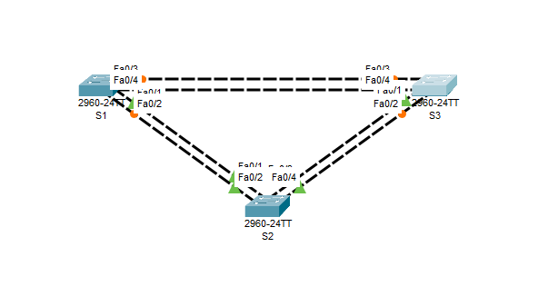
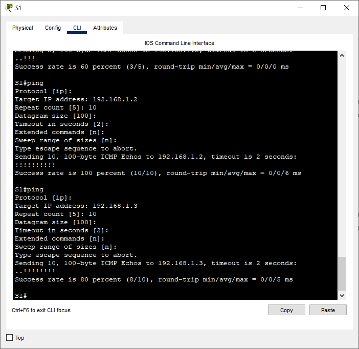
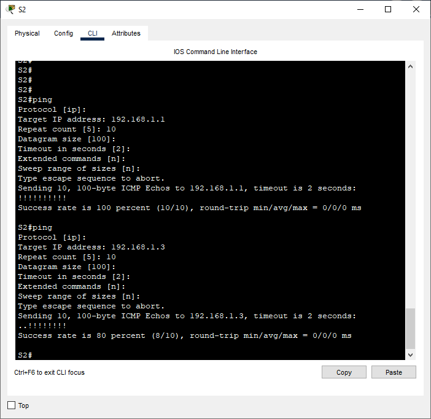
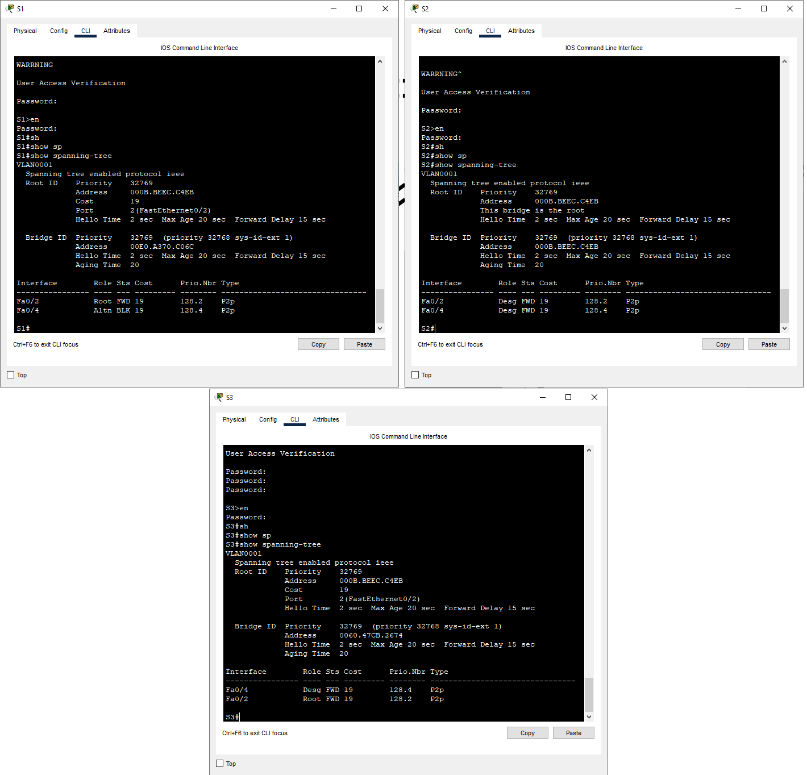

# Лабораторная работа. Развертывание коммутируемой сети с резервными канал  
    

 **Таблица адресации**   
  
| Устройство |Интерфейс    | IP-адрес     | Маска подсети  | 
|------------|-------------|--------------|----------------|
|    S1      | VLAN1       | 192.168.1.1  |255.255.255.0   | 
|    S2      | VLAN1       | 192.168.1.2  |255.255.255.0   |   
|    S3      | VLAN1       | 192.168.1.3  |255.255.255.0   |   


## Задачи   

1. Создание сети и настройка основных параметров устройства                 
2. Выбор корневого моста            
3. Наблюдение за процессом выбора протоколом STP порта, исходя из стоимости портов          
4. Наблюдение за процессом выбора протоколом STP порта, исходя из приоритета портов                 

## Ход выполнения работы    
### 1. Настройка основных параметров устройств    
Создали сеть согласно заданию:  
       

Произвели базовую конфигурацию коммутаторов [S1](config/base_setting_S1), [S2](config/base_setting_S2), [S3](config/base_setting_S3).       

После этого проверили связь между коммутаторами.        
        
            

### 2. Определение корневого моста.    
Отключим порты на коммутаторах      
``` 
S1(config)#interface range fa0/1-4
S1(config-if-range)#shutdown        
```     

Настроим подключенные порты в качестве транковых        
```     
S1(config-if-range)#switchport mode trunk 
S1(config-if-range)#switchport trunk allowed vlan 1     
```     

Включим порты F0/2 и F0/4 на всех коммутаторах      
``` 
S1(config)#interface range fa0/2,4
S1(config-if-range)#shutdown        
``` 
С помощью команды *show spanning-tree* посмотрим данные протокола STP   
         
Видим, что корневым мостом является S2. В данном случае он является таковым из-за самого меньшего значения MAC среди всех коммутаторов.         
Порты F0/2, F0/4 коммутатора S2 являются назначенными. Порт F0/2 коммутатора S1 являетсякорневым, а F0/4 альтернативным (был выбран таковым, потому что от него до корневого коммутатора самый длинный путь). Порт F0/2 коммутатора S3 является корневым, а F0/4 - назначенным.         

### 3. Наблюдение за процессом выбора протоколом STP порта, исходя из стоимости портов          
### 4. Наблюдение за процессом выбора протоколом STP порта, исходя из приоритета портов         
Для выполнения этого задания необходимо включить порты fa0/1, fa0/3 на каждом коммутаторе.      
После этого выполним команду *show spanning-tree*       
     
Мы видим, что на каждом из коммутаторов некорневого моста в качестве порта корневого моста выбран порт fa0/1, т.к. по протоколу STP при равной стоимости портов и равным BID выбирается порт с наименьшим номером.      
        
Вопросы для повторения.     
1.


