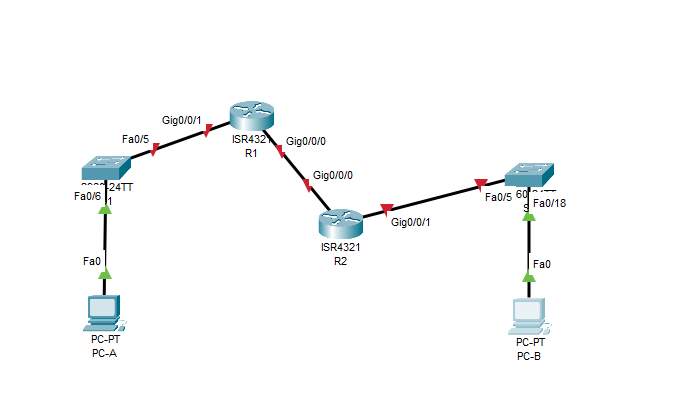
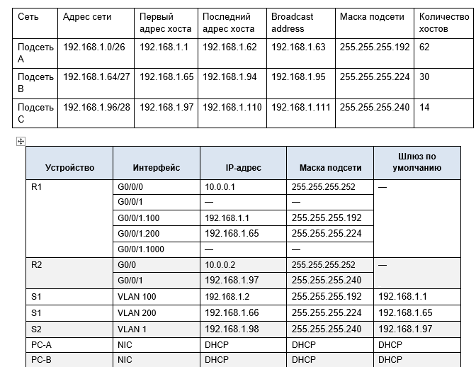
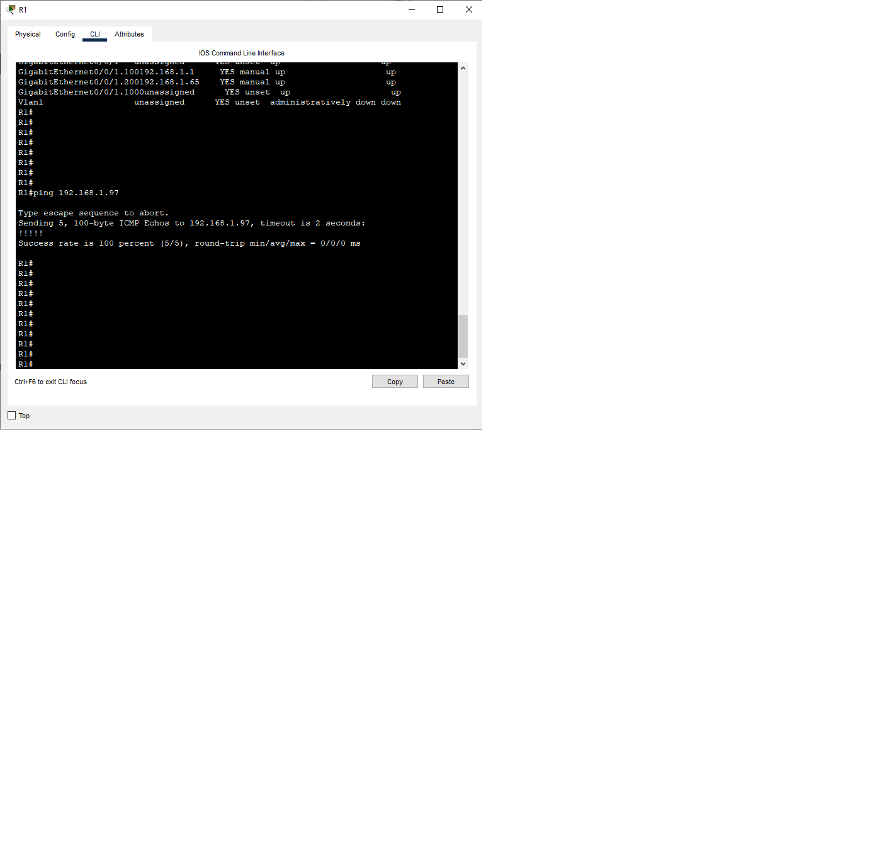
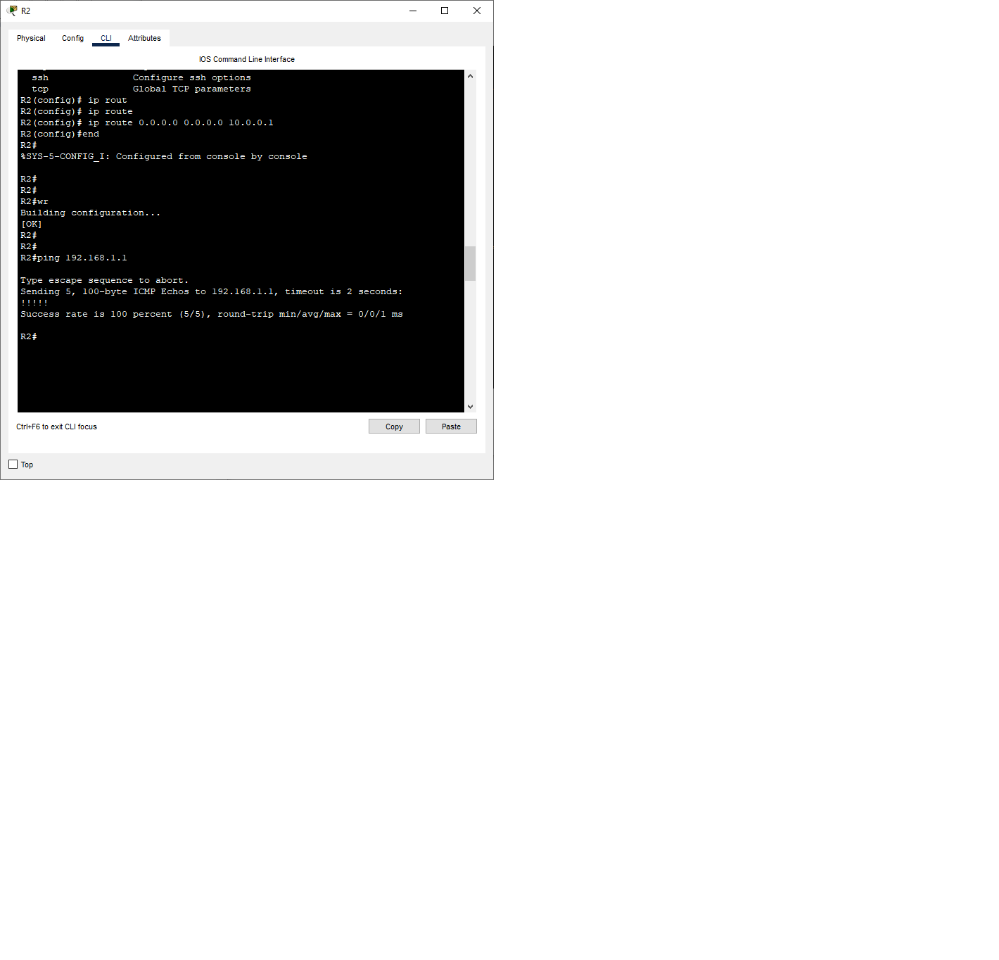
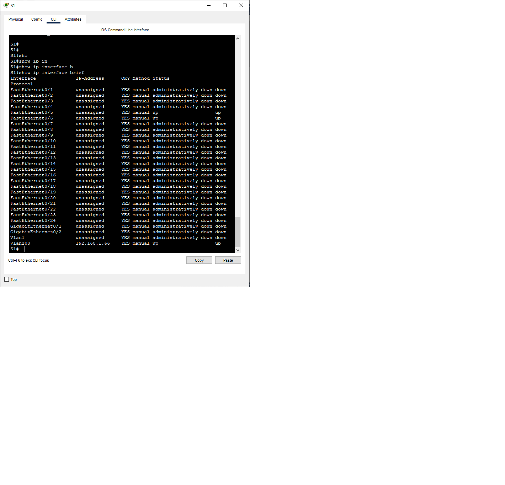
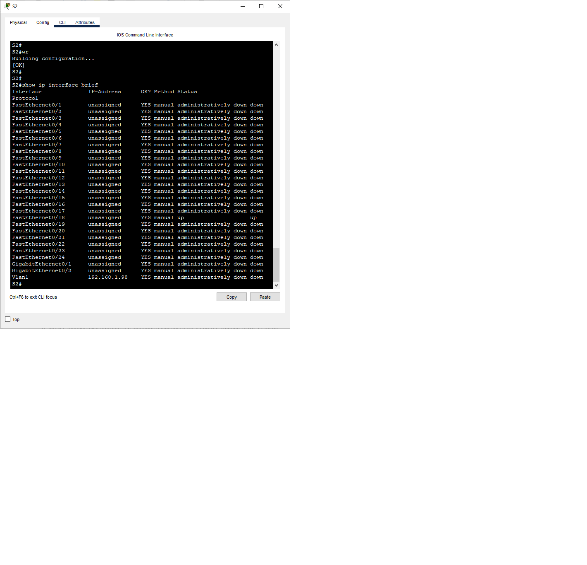
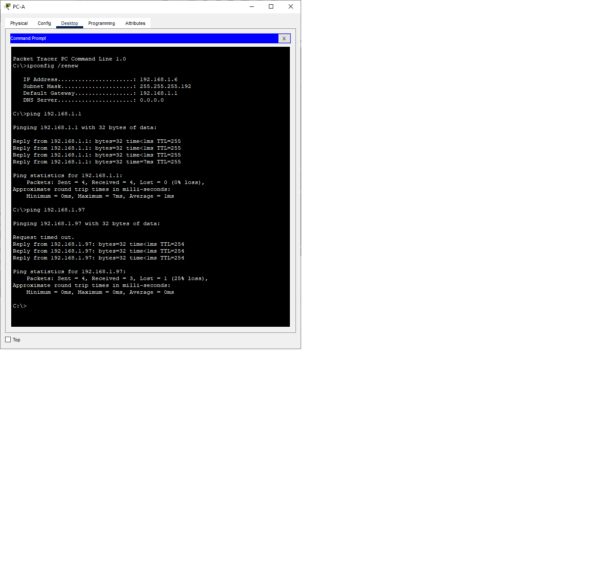
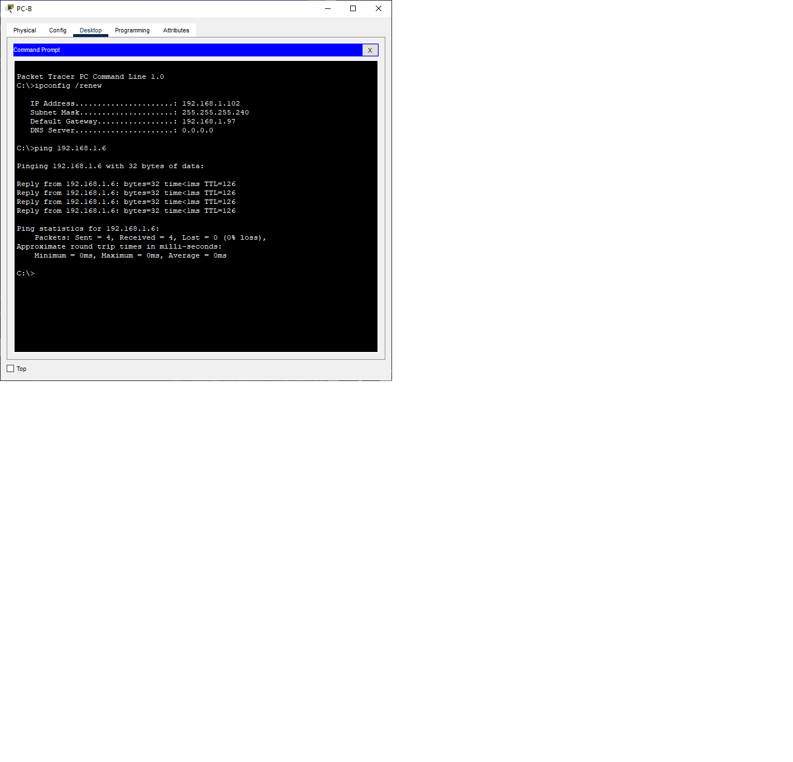

# Лабораторная работа. Настройка DHCPv4
## Задачи
**1. Создание сети и настройка основных параметров устройства** 

**2. Настройка и проверка двух серверов DHCPv4 на R1**

**3. Настройка и проверка DHCP-ретрансляции на R2**

## Ход выполнения работы    
### 1. Создание сети и настройка основных параметров устройств    
Для выполнения работы создадим сеть согласно топологии    
    

Необходимо разбить сеть 192.168.1.0/24 на подсети. Результат можем видеть ниже:   
      

Активируем интерфейс G0/0/1 на маршрутизаторе и настроим подинтерфейсы для каждой VLAN:   
   


Также настроим интерфейс G0/0/0 и пропишем маршрут по умолчанию.  
Конфигурацию маршрутизаторов после выполнения этих шагов можно посмотреть ниже:     
[R1](config/config_R1)      
[R2](config/config_R2)    

Для проверки правильности работы маршрутизации воспользуемся командой ping на роутерах:   
            
  
**Настроим коммутаторы S1 и S2**    
Создадим VLAN на S1 согласно таблице. Настроим интерфейс управления на S1 (VLAN 200) и на S2 (VLAN 1), установим шлюз по умолчанию.   
Все неиспользуемые порты в S1 добавим в VLAN Parking_Lot и деактивируем их. В S2 отключим все неиспользуемые порты.   
Порты f0/6 на S1 и f0/18 на S2 настроим в режиме доступа.   
Порт f0/5 на S1 настроим в качестве транка 802.1Q   
Конфиги коммутаторов [S1](config/config_S1) и [S2](config/config_S2) после произведенных настроек.  
      

### 2. Настройка и проверка двух серверов DHCPv4 на R1    
**Настроим R1 с пулами DHCP для двух подсетей**   
Исключии первые пять используемых адресов из каждого пула адресов.
```
R1(config)#ip dhcp excluded-address 192.168.1.1 192.168.1.5
R1(config)#ip dhcp excluded-address 192.168.1.97 192.168.1.101    
```   
Создадим пулы DHCP, в качестве имени домена укажем CCNA-lab.com, настроим шлюз по умолчанию.  
```   
R1(config)#ip dhcp pool VLAN100 
R1(dhcp-config)#network 192.168.1.0 255.255.255.192
R1(dhcp-config)#default-router 192.168.1.1
R1(dhcp-config)#domain-name ccna-lab.com    
```   
```   
R1(config)#ip dhcp pool R2_Client_LAN 
R1(dhcp-config)#network 192.168.1.96 255.255.255.240
R1(dhcp-config)#default-router 192.168.1.97
R1(dhcp-config)#domain-name ccna-lab.com    
```
Посмотрим сведения о пулах с помощью команды *show ip dhcp pool*
```   
R1#show ip dhcp pool

Pool VLAN100 :
 Utilization mark (high/low)    : 100 / 0
 Subnet size (first/next)       : 0 / 0 
 Total addresses                : 62
 Leased addresses               : 0
 Excluded addresses             : 2
 Pending event                  : none

 1 subnet is currently in the pool
 Current index        IP address range                    Leased/Excluded/Total
 192.168.1.1          192.168.1.1      - 192.168.1.62      0    / 2     / 62

Pool R2_Client_LAN :
 Utilization mark (high/low)    : 100 / 0
 Subnet size (first/next)       : 0 / 0 
 Total addresses                : 14
 Leased addresses               : 0
 Excluded addresses             : 2
 Pending event                  : none

 1 subnet is currently in the pool
 Current index        IP address range                    Leased/Excluded/Total
 192.168.1.97         192.168.1.97     - 192.168.1.110     0    / 2     / 14    
 ```    
 На компютере PC-A выполним команду *ipconfig* и посмотрим, получил ли он адрес.  
 Затем пропингуем порт G0/0/1 R2.
    
 
 ### 3. Настройка и проверка DHCP-ретрансляции на R2  
 **Настроим R2 в качестве агентаDHCP-ретрансляции для локальной сети**
 ```  
 R2(config-if)#ip helper-address 10.0.0.1 
 ```    
 На компьютере PC-B выполним команду *ipconfig*, а затем проверим подключение к компьютеру PC-A 
      
 
 Выполним *show ip dhcp binding* в R1 для проверки назначений адресов в DHCP    
 ```  
 R1#show ip dhcp binding 
IP address       Client-ID/              Lease expiration        Type
                 Hardware address
192.168.1.6      000B.BEBB.B064           --                     Automatic
192.168.1.102    0009.7C52.0400           --                     Automatic
R1#   
```
 

