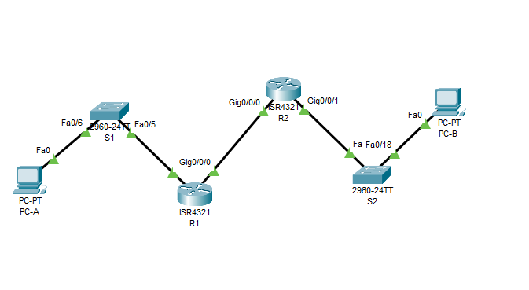
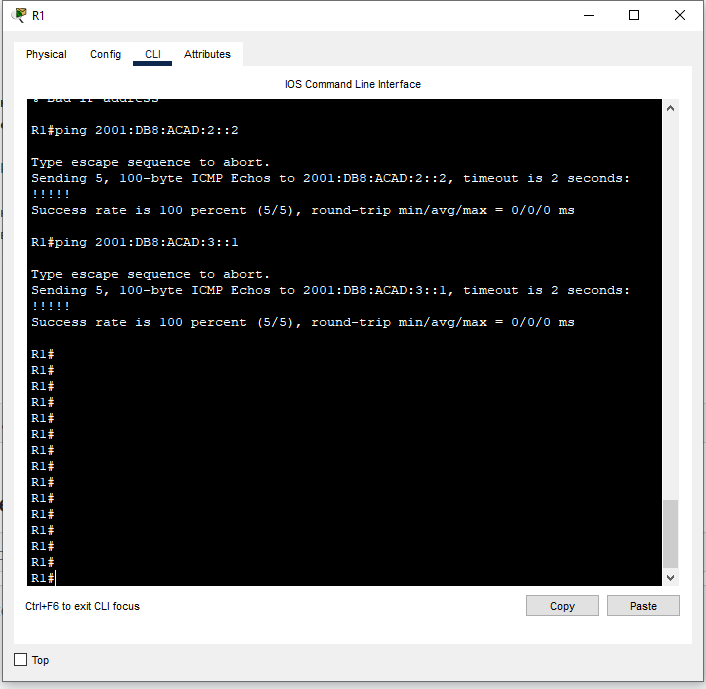
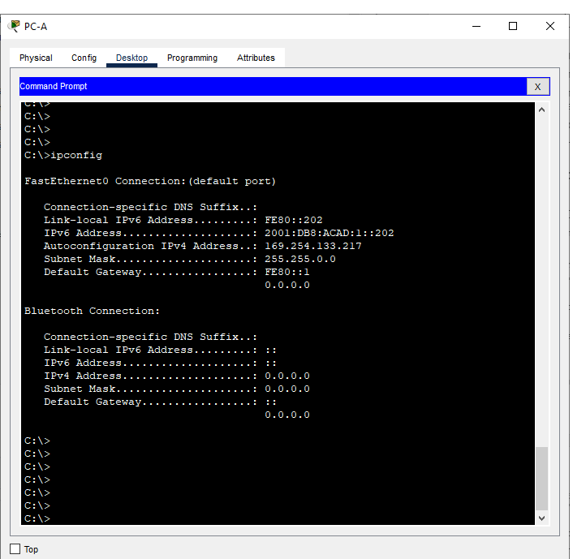
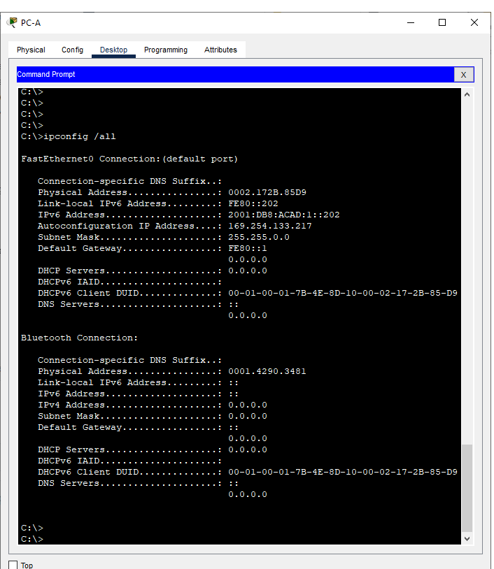
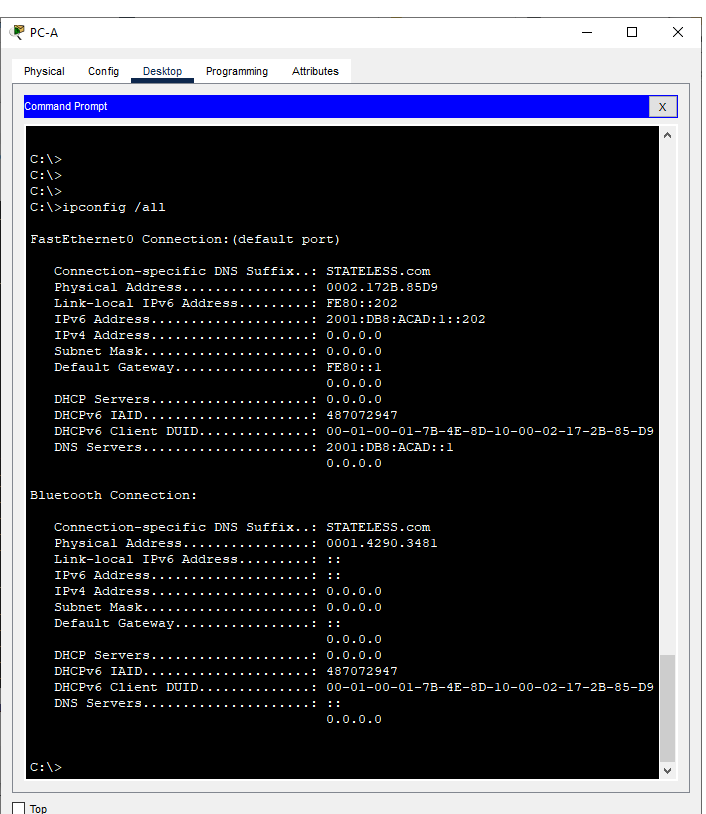
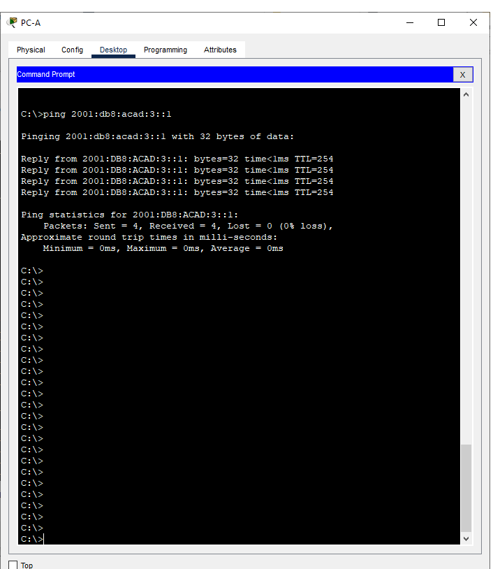

# Лабораторная работа. Настройка DHCPv6
## Задачи
**1. Создание сети и настройка основных параметров устройства** 

**2. Проверка назначения адреса SLAAC от R1**

**3. Настройка и проверка сервера DHCPv6 без гражданства на R1**

**4. Настройка и проверка состояния DHCPv6 сервера на R1**

**5. Настройка и проверка DHCPv6 Relay на R2**


  
    
     
      
  ***Таблица адресации*** 
  
  
| Устройство |Интерфейс     | IP-адрес               | 
|------------|--------------|---------------         |
|    R1      | G 0/0/0      | 2001:db8:acad:2::1/64  |
|            |              | fe80::1                |
|            | G 0/0/1      | 2001:db8:acad:1::1/64  |
|            |              | fe80::1                |  
|    R2      | G 0/0/0      | 2001:db8:acad:2::2/64  |
|            |              |  fe80::2               |     
|            | G 0/0/1      | 2001:db8:acad:3::1/64  |   
|    PC-A    | NIC          | DHCP  |
|    PC-B    | NIC          | DHCP  |   


## Ход выполнения работы    
### 1. Создание сети и настройка основных параметров устройств    
Для выполнения работы создадим сеть согласно топологии    
    

С помощью команды *ip route* настроим статические маршруты
Настройка базовых конфигураций [R1](config/base_setting_R1), [R2](config/base_setting_R2), 
Настройка PC-A и PC-B заключается в включении автоматического получения IP адреса.  
Для проверки статического маршрута пропингуем с R1 адрес порта G0/0/1 на R2:
    


### 2. Проверка назначения адреса SLAAC от R1     
С помощью команды *ipconfig*, выполненой на PC-A, мы можем увидеть, что компьтеру присвоен адресс из сети 2001:db8:1::/64   
     

### 3. Настройка и проверка сервера DHCPv6 на R1    
Выполним настройку DHCPv6 сервера, чтобы PC-A мог получать информацию о DNS-сервере и домене.
```   
R1(config)#ipv6 dhcp pool R1-STATELESS
R1(config-dhcpv6)#dns-server 2001:db8:acad::1
R1(config-dhcpv6)#domain-name STATELESS.com
R1(config-dhcpv6)#exit
R1(config)#interface g0/0/1
R1(config-if)#ipv6 nd other-config-flag
R1(config-if)#ipv6 dhcp server R1-STATELESS  
```     

Теперь можем сравнить выполнение команды *ipconfig /all* до и после настройки:    
   
   

И протестируем связь PC-A  с интерфейсом g0/0/1 R2:   

    
### 4. Настройка сервера DHCPv6 с сохранением состояния на R1       
Настроим R1 для ответа на запросы DHCPv6 от локальной сети на R2.     

Создадим пул DHCPv6 на R1 для сети 2001:db8:acad:3:aaa::/80. Это предоставит адреса локальной сети, подключенной к интерфейсу G0/0/1 на R2. В составе пула задайте DNS-сервер 2001:db8:acad: :254 и зададим доменное имя STATEFUL.com.
```
R1(config)# ipv6 dhcp pool R2-STATEFUL
R1(config-dhcp)# address prefix 2001:db8:acad:3:aaa::/80
R1(config-dhcp)# dns-server 2001:db8:acad::254
R1(config-dhcp)# domain-name STATEFUL.com   
```

Назначим только что созданный пул DHCPv6 интерфейсу g0/0/0 на R1.   
```
R1(config)# interface g0/0/0
R1(config-if)# ipv6 dhcp server R2-STATEFUL   
```   

### 5. Настройка и проверка ретрансляции DHCPv6 на R2.    
Ретрансляцию настраиваем с помощью команды *ipv6 dhcp relay* на интерфейсе G0/0/1 
```
R2(config) # interface g0/0/1
R2(config-if)# ipv6 nd managed-config-flag
R2(config-if)# ipv6 dhcp relay destination 2001:db8:acad:2::1 g0/0/0


    

